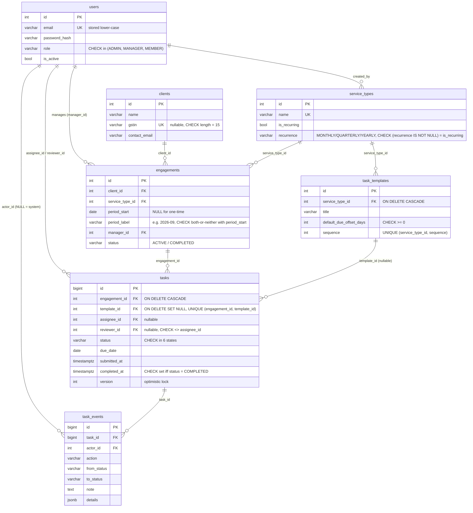

# Engagement Tracker: Technical Design Note

A task and engagement management tool for a CA / GST practice. Managers open **engagements** (a piece of client work, for example "Arora Textiles · Monthly GST Compliance · 2026-08"). Each engagement's **tasks** are generated from the service's **task templates**. Members move tasks through a review workflow, and recurring services roll forward period by period.

## 1. Architecture

```
 Browser ──HTTPS──▶ Next.js (Vercel)            static client app, calls the API with a bearer token
    │
    └──HTTPS/JSON──▶ FastAPI (Render)           routers → services → SQLAlchemy models
                          │
                          └──TLS──▶ PostgreSQL (Neon)   schema managed by Alembic
```

| Layer | Choice | Notes |
|---|---|---|
| Frontend | Next.js 16 (App Router), TypeScript, Tailwind | Client-rendered pages. It never decides permissions: status buttons come from the API's `allowed_actions`. Covered by Playwright end-to-end tests. |
| Backend | FastAPI, SQLAlchemy 2.0 (typed), Pydantic v2 | Python 3.13. Stateless, so it scales horizontally. |
| Database | PostgreSQL 16 | The design depends on partial unique indexes, `ON CONFLICT`, CHECK constraints, JSONB and `COUNT(*) FILTER`. |
| Auth | Email + password (bcrypt, cost 12), JWT HS256 access token (8h) | The role lives on the user row and is re-read from the DB on every request, so deactivating a user or changing their role takes effect immediately. |
| Deployment | Vercel (web), Render (API, runs `alembic upgrade head` on start), Neon (Postgres) | GitHub Actions runs pytest against a Postgres service, lint and build for the web app, and the Playwright suite. |

## 2. Data model



**Indexes:** `uq_engagements_recurring_period` UNIQUE (client_id, service_type_id, period_start) **WHERE period_start IS NOT NULL**; `engagements(client_id, service_type_id)`; `engagements(manager_id)`; `tasks(assignee_id, status)`; `tasks(status, due_date)`; `tasks(engagement_id)`; `task_events(task_id, created_at)`.

**Changes from the brief:**
- `tasks.assignee_id` is nullable, so work can be created before anyone is staffed. `START` refuses an unassigned task (409 `TASK_UNASSIGNED`).
- I added `tasks.sequence` for ordering, `tasks.description`, `engagements.status` (it completes automatically when the last task is approved), and `task_events.details` (JSONB) so assignment and due-date changes are audited as well.
- `task_events.actor_id` is nullable so scheduled generation can be recorded as "System".
- Enums are stored as VARCHAR + CHECK rather than native PG enums: adding a state later is an ordinary migration.
- Quarterly and yearly periods follow the Indian financial year (April–March), which is how GST returns work.

## 3. Backend design

```
app/
  routers/      HTTP only: parse the request, call one service function, shape the response
  services/     use cases, transactions, object-level permission checks
    access.py   row-visibility rules as SQL predicates (shared by lists, detail, dashboard)
  domain/
    workflow.py pure state machine (no DB, no HTTP)
    periods.py  pure period arithmetic (next month / FY quarter / FY year, labels)
  models.py     SQLAlchemy 2.0 typed models   schemas.py  Pydantic v2 request/response models
  errors.py     domain exceptions and the ONE place they become HTTP responses
```

- **Validation happens at two levels.** Pydantic checks shape and format at the edge: GSTIN regex, `recurrence iff is_recurring`, required fields. The services re-check business invariants: the period is aligned to a period start, the manager has the right role, the reviewer is not the assignee, the task is not already completed. The database is the last line of defence: FKs, CHECKs and unique indexes hold even if a code path is missed.
- **Transactions are explicit.** A request gets one session. Each use case wraps its writes in `with transaction(db):`, which commits on success and rolls back everything on any exception.
- **Errors share one shape:** `{"error": {"code", "message", "details?"}}`. Domain exceptions map to HTTP codes: 401 `UNAUTHENTICATED`, 403 (`FORBIDDEN`, `SELF_APPROVAL_FORBIDDEN`), 404, 409 (`INVALID_TRANSITION`, `STALE_VERSION`, `DUPLICATE_ENGAGEMENT`, `TASK_COMPLETED`), 422 (`VALIDATION_ERROR`, `NOTE_REQUIRED`). A safety-net handler maps a raced unique violation to 409, an FK violation to 422, and any other integrity error to 500, because that means a bug.
- **Lists use keyset pagination** (`limit` + opaque `cursor`, which encodes the last row's sort key) instead of OFFSET.
- **No N+1 queries.** Task lists eager-load engagement, client, service type, assignee and reviewer with JOINs. Engagement cards get their status counts from a single GROUP BY query.
- **Logging** is structured JSON lines with a request id (`x-request-id`), method, path, status and duration.

## 4. Authentication and authorization

1. `POST /auth/login` verifies the bcrypt hash and returns a JWT (`sub` = user id). For an unknown email the server still checks against a dummy hash, so response timing does not reveal which emails exist.
2. The `get_current_user` dependency decodes the token and loads the user. Inactive or missing users get 401.
3. **Coarse role checks** are FastAPI dependencies on the route (`AdminUser`, `ManagerOrAdmin`). They answer "may this kind of user call this endpoint at all?"
4. **Object-level checks** live in the services because they need the data:
   - **Visibility** (`services/access.py`): ADMIN sees everything. A MANAGER sees the engagements they manage plus any task where they are the assignee or reviewer. A MEMBER sees only tasks assigned to them. These rules are SQL predicates, so lists, detail views and the dashboard all use the same rule and the filtering happens in the database.
   - **Actions**: only the engagement's manager or an admin can assign, set a reviewer or change a due date. Workflow permissions come from the state machine (section 6).

## 5. Recurring generation

- **How it works.** `POST /engagements/{id}/generate-next` computes the next period from the source engagement's `period_start` and the service's recurrence. Monthly, FY quarter and FY year are handled in `domain/periods.py`. It then creates the engagement and its tasks. Assignees and reviewers carry forward from the source engagement, matched by template. Due dates are the period end plus each template's offset, so GSTR-1 falls on the 11th of the following month.
- **Scheduler entry point.** `POST /admin/recurring/generate {as_of}` and `python -m app.cli generate-recurring --as-of …` find the latest engagement for each (client, recurring service) pair (`DISTINCT ON`). They create every missing period up to the one containing `as_of`, so a scheduler that was down for three days catches up.
- **Duplicate prevention lives in the database.** The engagement row is inserted with `INSERT … ON CONFLICT (client_id, service_type_id, period_start) WHERE period_start IS NOT NULL DO NOTHING RETURNING id`. If no id comes back, the period already exists and the existing engagement is returned. Two concurrent callers cannot both win: the second one blocks on the first one's uncommitted index entry, then does nothing. A manual `POST /engagements` for an existing period returns 409 `DUPLICATE_ENGAGEMENT` with the existing id.
- **Running it twice:** `generate-next` returns 201 `{created: true}` the first time and 200 `{created: false}` with the same engagement after that. The batch endpoint reports `created: []` and counts the pairs that are `already_existed`.
- **Failing partway:** the engagement insert, all task inserts and their `CREATED` audit events are one transaction. If anything fails, all of it rolls back, so there is never an engagement without tasks. In the batch job, each engagement is its own transaction. One client's failure is reported in `failed[]` and does not undo the others, and re-running retries only what is still missing: a pair's catch-up stops at its first failed period, so the next run resumes exactly there. The tests cover this by making the database reject the second task mid-insert.

## 6. Workflow enforcement

`domain/workflow.py` is the single source of truth. It is a table of `Action → (allowed from-states, to-state, kind, note required?)`:

| Action | From | To | Who |
|---|---|---|---|
| START | NOT_STARTED | IN_PROGRESS | assignee (or engagement manager / admin) |
| WAIT_FOR_CLIENT *(note required)* | IN_PROGRESS | WAITING_FOR_CLIENT | " |
| RESUME | WAITING_FOR_CLIENT, CHANGES_REQUESTED | IN_PROGRESS | " |
| SUBMIT_FOR_REVIEW | IN_PROGRESS | READY_FOR_REVIEW | " |
| APPROVE | READY_FOR_REVIEW | COMPLETED | engagement manager, designated reviewer (manager/admin), or admin, **never the assignee** |
| REQUEST_CHANGES *(note required)* | READY_FOR_REVIEW | CHANGES_REQUESTED | " |

The task service runs the checks in a fixed order: **permission (403) → version (409 `STALE_VERSION`) → transition validity (409 `INVALID_TRANSITION`) → note (422)**. The self-approval check comes before the role check, so a manager who is assigned their own task still cannot approve it. The state change and its `task_events` row are written in the same transaction.

**Optimistic locking.** The client sends the `version` it last saw, and a mismatch returns 409 immediately. SQLAlchemy's `version_id_col` also turns the UPDATE into `… WHERE id = :id AND version = :old`, so a write that races in between the read and the write matches no row and also returns 409. The losing write's audit event rolls back with it.

The same module exposes `allowed_actions(actor, task)`. The API returns it with every task, and the UI renders only those buttons.

## 7. Tests

**Backend** (pytest, real PostgreSQL, schema built by running the Alembic migrations).

The seven required cases: (1) a member cannot move, edit or read another member's task → 403; (2) a duplicate recurring engagement → 409, the raw DB insert is blocked by the unique index, and `generate-next` twice → same engagement, no new rows; (3) NOT_STARTED → COMPLETED and other illegal moves → 409; (4) manager approval → COMPLETED plus an audit event (actor, from/to, note), and the engagement auto-completes; (5) a manager or admin assigned to a task cannot approve it, but a designated reviewer can; (6) creation fails mid-way (the DB rejects the second task) → no engagement, tasks or events, including for `generate-next` and the batch job; (7) a stale version → 409, plus a true two-session race caught by the DB version check.

Also covered: an exhaustive state × action matrix for the pure state machine; period arithmetic (month, FY quarter and FY year boundaries, catch-up); role-scoped visibility for lists, detail and dashboard; dashboard bucket counts; overdue and due-today filters; keyset pagination (no duplicates or gaps); login, inactive users and missing tokens; admin-only endpoints; GSTIN validation; clients in use cannot be deleted; template edits don't change existing tasks; reviewer ≠ assignee. Also: a failed period in a catch-up run is retried on the next run, and passwords over 72 bytes are rejected with 422. **92 tests in total.**

**End-to-end** (Playwright, 25 tests in `frontend/e2e/`). They drive the real UI against the real API and an isolated `engagement_e2e` database that is migrated and re-seeded on every run: sign-in and role-aware navigation, the member work cycle, approve / request changes / no self-approval, reassignment with audit history, duplicate periods and idempotent generation, admin CRUD, stale-version recovery and the phone layout. CI runs them as a separate job.

## 8. Production at 5 million tasks

- **Indexes:** the existing composites serve the hot paths: "my open tasks" via `(assignee_id, status)`, overdue and due-today via `(status, due_date)`. I would add a **partial index** `tasks(due_date) WHERE status <> 'COMPLETED'`, since most rows will be completed and should not bloat the index for open work. `task_events` could be partitioned by month, or archived after the retention period.
- **Keyset pagination** is already used everywhere. Page 1,000 costs the same as page 1, and OFFSET scans are avoided.
- **Recurrence as background jobs:** move generation from the request path to a scheduled worker (Render Cron / Celery / arq) that enqueues one job per (client, service) pair. It keeps the same idempotent `ON CONFLICT` insert, so retries and duplicate deliveries are harmless.
- **Dashboard:** the counts are already one `COUNT(*) FILTER` scan per scope. At scale, keep a `task_counters(scope_user_id, bucket, n)` table maintained by the service in the same transaction as each transition, or a materialized view refreshed every minute. "Overdue" changes with the clock, so it should be recomputed by a nightly job rather than on every write. Cache per-user results for 30–60 seconds.
- **Operations:** structured JSON logs with request ids (already in place) shipped to a log store; RED metrics (rate, errors, duration) per route plus a counter for generation jobs; OpenTelemetry tracing across FastAPI → SQLAlchemy; connection pooling (PgBouncer / Neon pooler); read replicas for dashboards.

## 9. Trade-offs

1. **Recurring schedule is inferred from the latest engagement instead of a `client_services` subscription table.** This is simpler and meets the brief, but you cannot stop a client's recurring service without an extra flag. A real product would add a subscription table (start/end period, default staffing), and the generator would read from it.
2. **JWT in localStorage, stateless auth.** This is simple and works across Vercel and Render domains. The costs: XSS exposure of the token, and no server-side revocation beyond deactivating the user, which *is* enforced because the user row is re-read on every request. For production I would use short-lived access tokens with a rotating refresh token in an httpOnly cookie behind a same-site API domain.
3. **Optimistic rather than pessimistic locking.** Conflicts are rare (one assignee per task), so versioning avoids holding row locks while a user thinks. The cost is that the client must handle 409 by reloading, which the task drawer does automatically.
