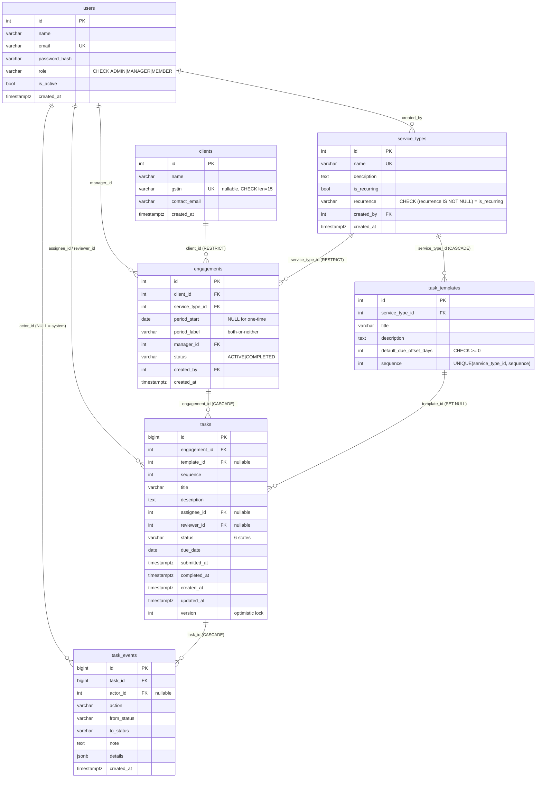
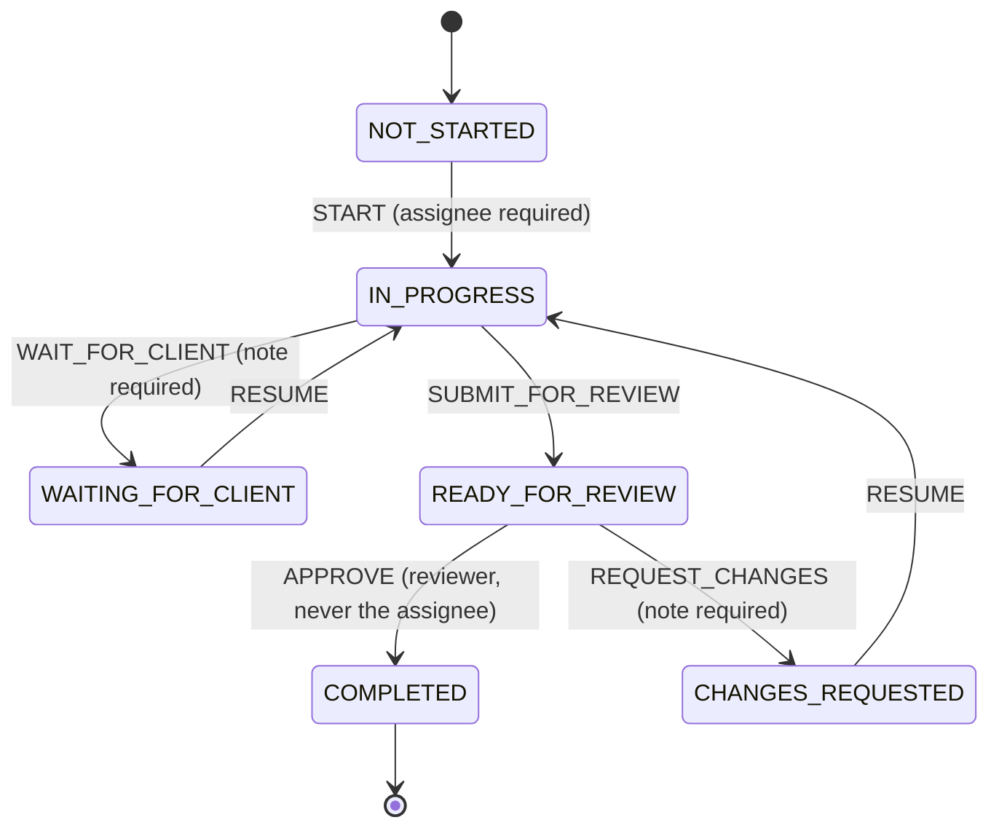
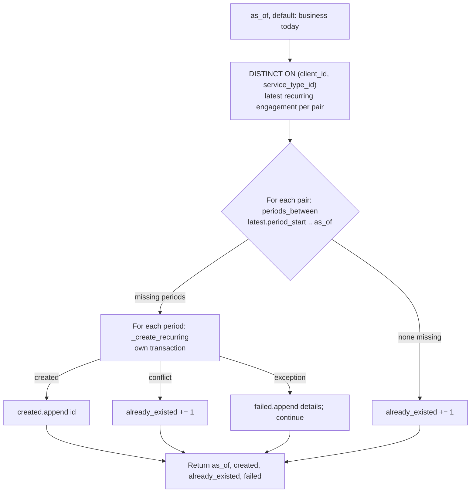

# Ledgerline Engagement Tracker: The Complete Project Guide

This guide explains the whole project: what it does, how it is built, and why each decision was made. It is written so you can study it before an interview and defend every line of the code. Everything here matches the code in this repository. File paths are relative to the repository root.

Companion documents: `README.md` covers setup, and `docs/DESIGN.md` is the short design note submitted with the assignment. This guide goes deeper than both.

---

## Table of contents

1. [What the product is](#1-what-the-product-is)
2. [Tech stack](#2-tech-stack)
3. [Architecture](#3-architecture)
4. [Database design](#4-database-design)
5. [Backend deep dive](#5-backend-deep-dive)
6. [Frontend deep dive](#6-frontend-deep-dive)
7. [Testing strategy](#7-testing-strategy)
8. [Running locally and deploying](#8-running-locally-and-deploying)
9. [Scaling to 5 million tasks](#9-scaling-to-5-million-tasks)
10. [Interview preparation](#10-interview-preparation)
11. [Glossary](#11-glossary)

---

## 1. What the product is

### 1.1 The business problem in plain language

A **Chartered Accountant (CA) firm** in India does compliance work for many business clients. A large share of that work is **GST (Goods and Services Tax)**. Every GST-registered business has a **GSTIN** (a 15-character GST identification number) and must file returns on a fixed schedule:

- **GSTR-1**: a return listing the business's **sales** (outward supplies) for the month. It is due around the 11th of the following month.
- **GSTR-3B**: a summary return where the business declares its tax liability, claims **Input Tax Credit (ITC)** (tax already paid on purchases), and **pays** the net tax. It is due around the 20th of the following month.
- **GSTR-2B**: a statement the GST portal generates automatically from suppliers' filings. Accountants **reconcile** the purchase register against GSTR-2B, so the client only claims ITC that suppliers have actually reported.

Besides monthly returns, the firm also does one-off jobs:

- **GST Registration** (form **REG-01**): getting a new GSTIN for a business.
- **GST Refund** (form **RFD-01**): claiming a refund, for example for exporters or businesses with an inverted duty structure (tax on inputs higher than tax on outputs).

Without a tool, the firm tracks this in spreadsheets and WhatsApp messages. Deadlines get missed, nobody knows who is waiting on which client, and there is no record of who approved what. This app replaces that.

### 1.2 The key concepts

| Concept | Meaning | Example |
|---|---|---|
| **Client** | A business the firm serves | Arora Textiles Pvt Ltd |
| **Service type** | A kind of work the firm offers. It is either one-time or recurring (monthly, quarterly, yearly) | Monthly GST Compliance |
| **Task template** | One checklist step of a service, with a due-date offset in days | "Prepare & file GSTR-1", +11 days |
| **Engagement** | One concrete piece of work for one client, for one service, for one period | Arora Textiles · Monthly GST Compliance · 2026-08 |
| **Period** | The time window a recurring engagement covers | the month of August 2026 (`period_start = 2026-08-01`, label `2026-08`) |
| **Task** | One unit of work inside an engagement, generated from a template, with an assignee, an optional reviewer, a due date and a status | "Prepare & file GSTR-1" for Arora, Aug 2026, assigned to Anita |

When a manager creates an engagement, the system copies every template of that service into real tasks. For recurring services, due dates count from the **end of the period**. The GSTR-1 template has offset 11, so for August (which ends on 31 Aug) the task is due on 11 September. That matches the real GST calendar.

### 1.3 Roles

| Role | What they do |
|---|---|
| **Admin** | Manages reference data (clients, services and their checklists, people). Sees everything. Can act as a manager on any engagement. Can run the recurring generator. |
| **Manager** | Creates engagements they will manage, assigns and reassigns tasks, sets deadlines and reviewers, reviews submitted work (approve or request changes), and generates the next period of recurring work. |
| **Team member** | Works on tasks assigned to them: start, pause while waiting for the client, resume, submit for review. Cannot approve anything and cannot reassign. |

### 1.4 A day in the life (seeded demo data)

Run the seed (section 8) and log in with these accounts. The UI brand is **Ledgerline**. The seed creates 7 users, 5 clients, 3 service types and **54 tasks**. Dates are relative to the day you run the seed, so there is always overdue work, work due today and upcoming work. Every seeded status was reached through the real workflow service, so every task has a genuine audit history (`backend/app/seed.py`).

**Anita Desai, team member** (`anita@example.com` / `Member@123`)
She lands on the dashboard, which says "Tasks assigned to you." She only sees Arora Textiles tasks, because that is her client. Last month's GSTR-1 is sitting in *Ready for review* (she submitted it, and now she has to wait for Priya). Last month's GSTR-3B is *In progress*. This month's "Collect sales & purchase data" is *In progress* and due today. She opens a task, clicks **Start work**, then **Waiting on client** (the app forces her to type a note, such as "Purchase register for the month"), later **Resume work**, then **Submit for review**. She never sees an Approve button or the assignment editor.

**Priya Sharma, manager** (`priya.manager@example.com` / `Manager@123`)
She manages Arora Textiles (staffed by Anita) and Bharat Agro Foods (staffed by Karan), plus a GST Refund engagement for Bharat. Her "In review" tile shows Anita's GSTR-1, which she approves with a note. Karan's purchase reconciliation is *Waiting for client*. She reassigns a Bharat task and moves its deadline, and both changes appear in the task's activity timeline. On the refund engagement she assigned the last task ("Follow up with officer...") to **herself** and made Rahul the reviewer. When she opens it she sees no Approve button: nobody approves their own work, not even the engagement manager. On an engagement page she clicks **Generate next period**. The first click creates next month with 4 tasks. The second click says the period already exists and creates nothing.

**Rahul Verma, manager** (`rahul.manager@example.com` / `Manager@123`)
He manages Coastal Logistics (Neha), Deccan Software (Vikram) and a GST Registration for Evergreen Pharma (Neha). He sent Neha's Coastal data collection back with *Changes requested* ("Figures do not tie to the sales register"). Vikram's GSTR-3B is waiting for his review. He is also the **designated reviewer** on Priya's refund task, so he can approve it even though he does not manage that engagement.

**Asha Admin** (`admin@example.com` / `Admin@123`)
She sees every engagement. Under **Admin** in the sidebar she adds clients (GSTIN is validated), builds service checklists, adds people and changes their roles, and deactivates people instead of deleting them. On the Services page she runs **Recurring generation** ("Run now"), and running it twice creates nothing new the second time.

The other members, `karan@example.com`, `neha@example.com` and `vikram@example.com`, all use the password `Member@123`.

---

## 2. Tech stack

### 2.1 Backend

| Technology | What it is | Why it was chosen | Alternatives, and why not |
|---|---|---|---|
| **Python 3.13** | Language runtime | Mature and readable. `StrEnum` and `datetime.UTC` (3.11+) are used. Render and CI pin 3.13 | Node/TypeScript would also work. Python keeps the backend small and gives SQLAlchemy, the most capable ORM for Postgres-specific features |
| **FastAPI** | Web framework built on Starlette and Pydantic | Declarative validation, dependency injection (used for auth and roles), automatic OpenAPI docs at `/docs`, very little boilerplate | **Django + DRF**: heavier, with its own ORM and a built-in admin this project does not need. **Flask**: no built-in validation or OpenAPI, so you would reassemble what FastAPI already has |
| **SQLAlchemy 2.0** (2.1.1 pinned) | ORM and SQL toolkit | Typed `Mapped[...]` models, full access to Postgres features (`ON CONFLICT ... WHERE`, `DISTINCT ON`, `COUNT FILTER`, row-value comparison), and `version_id_col` for optimistic locking | **SQLModel**: a thin layer over SQLAlchemy that adds little here. **Raw SQL**: more code and no unit of work. **Django ORM**: tied to Django |
| **Alembic** | Schema migration tool for SQLAlchemy | A versioned, reviewable schema history. Tests build the schema by running the migration, which proves the migration works | `Base.metadata.create_all()` has no history and cannot evolve a production schema |
| **Pydantic v2** | Data validation library (Rust core) | Validates request shape at the edge (GSTIN regex, "recurrence set if and only if recurring", required fields) and serialises responses | Marshmallow is slower and not integrated with FastAPI |
| **pydantic-settings** | Typed configuration from environment variables and `.env` | One typed `Settings` class (`backend/app/config.py`) with defaults | Reading `os.environ` by hand gives no typing and scatters defaults |
| **PostgreSQL 16** | Relational database | The design depends on Postgres features: partial unique indexes, `INSERT ... ON CONFLICT`, CHECK constraints, JSONB and `COUNT(*) FILTER` | **MySQL** has no partial indexes and no `FILTER`. **SQLite** has weak concurrency and would make the tests prove nothing about production. **MongoDB** does not fit a relational domain full of foreign keys and constraints |
| **psycopg 3** (`psycopg[binary]`) | Postgres driver | The maintained successor to psycopg2. Exposes `sqlstate` on errors, which the integrity-error handler uses | psycopg2 is in maintenance mode. **asyncpg** is async-only, and this app is synchronous |
| **bcrypt** | Password hashing library | Slow, salted, industry-standard hashing. Cost 12 in production, lowered to 4 in tests for speed | **Argon2id** is the more modern first choice. bcrypt is still acceptable and simpler. **passlib** is unmaintained, so the `bcrypt` package is used directly |
| **PyJWT** | JSON Web Token encode/decode | Small and well maintained. HS256 signed access tokens | **python-jose** is less maintained. **Server sessions** would need a session store and cookies across two domains |
| **Uvicorn** | ASGI server | Standard server for FastAPI | Gunicorn with Uvicorn workers for multi-process production |
| **pytest** | Test runner | Fixtures (`world`, `engagement`), parametrisation (the 36-case state matrix), clean output | `unittest` is more verbose |
| **httpx / FastAPI TestClient** | In-process HTTP client | Tests call the real app through HTTP (routing, auth, error handlers) without starting a server | A live server with `requests` is slower and harder to control |

A note on **sync versus async**: every route is a plain `def`, not `async def`. FastAPI runs sync routes in a thread pool, so the server stays responsive. With a synchronous driver and ORM, async would add complexity without any benefit at this scale.

### 2.2 Frontend

| Technology | What it is | Why | Alternatives, and why not |
|---|---|---|---|
| **Next.js 16 (App Router)** | React framework | File-based routing, layouts (`app/(app)/layout.tsx` wraps every signed-in page), `next/font`, and native Vercel hosting | **Vite + React Router** would also work. Next gives routing, layouts and font handling with zero config. **Remix** is fine but has a smaller ecosystem |
| **React 19** | UI library | Current stable React, required by Next 16 | none |
| **TypeScript** | Typed JavaScript | `lib/api.ts` mirrors the API's response types, so the compiler catches contract mismatches | Plain JS catches nothing |
| **Tailwind CSS v4** | Utility-first CSS | Fast styling. Design tokens live in CSS (`@theme inline` in `app/globals.css`), not in a JS config | **Component libraries** (MUI, Chakra) are heavy and look generic. **CSS modules** mean more files. Small hand-written primitives in `components/ui.tsx` are enough |
| **Geist font** | Typeface loaded with `next/font/google` | Clean UI font. `next/font` self-hosts it, so there is no layout shift and no request to Google at runtime | System fonts look inconsistent across operating systems |
| **Playwright** | Browser end-to-end testing | Auto-waiting, role-based locators, a `webServer` config that boots the API and web app itself, traces on failure | **Cypress** runs inside the browser, has weaker multi-tab and multi-origin support, and is slower |

### 2.3 Tooling and hosting

| Technology | Role | Why | Alternatives |
|---|---|---|---|
| **GitHub Actions** | CI (`.github/workflows/ci.yml`) | Free for public repos. Runs pytest against a real Postgres service container, then lint and build for the web app | CircleCI, GitLab CI |
| **Docker Compose** | Local Postgres only (`docker-compose.yml`) | One command gives Postgres 16 plus an `engagement_test` database (`infra/init-test-db.sql`) | Installing Postgres natively is more work and harder to reproduce |
| **Render** | API hosting via blueprint (`render.yaml`) | Deploys from Git, runs migrations on start, has a health check | Railway, Fly.io, Heroku |
| **Neon** | Managed serverless Postgres | Free tier, standard Postgres (so all the features above work), built-in pooler | Supabase, AWS RDS, Render Postgres |
| **Vercel** | Web hosting | Made by the Next.js team, zero config | Netlify, Cloudflare Pages |

---

## 3. Architecture

### 3.1 The big picture

```
 Browser ──HTTPS──▶ Next.js app (Vercel)     client-rendered pages; token in localStorage
    │
    └──HTTPS/JSON (Authorization: Bearer …)──▶ FastAPI (Render)
                                                 routers → services → domain + models
                                                     │
                                                     └──TLS──▶ PostgreSQL (Neon), schema via Alembic
```

The web app is a static client application. It does not render data on the server. Every page is a `"use client"` component that calls the API directly from the browser. The API is stateless (no sessions), so you can run many copies behind a load balancer.

### 3.2 Request lifecycle: clicking "Approve"

Here is exactly what happens when Priya clicks **Approve** in the task drawer.

```mermaid
sequenceDiagram
    autonumber
    participant U as Priya (browser)
    participant D as TaskDrawer.tsx
    participant C as lib/api.ts request()
    participant M as FastAPI middleware (main.py)
    participant R as routers/tasks.py
    participant Dep as deps.get_current_user
    participant S as services/tasks.transition
    participant W as domain/workflow.py
    participant DB as PostgreSQL

    U->>D: click "Approve", type optional note, submit
    D->>C: api.transition(id, "APPROVE", version, note)
    C->>M: POST /tasks/{id}/transitions {action, note, version} + Bearer token
    M->>R: assign request id, start timer
    R->>R: Pydantic validates TransitionIn (action is a known enum, version >= 1)
    R->>Dep: resolve CurrentUser
    Dep->>DB: SELECT user by id from JWT "sub"
    Dep-->>R: active User (else 401)
    R->>S: transition(db, user, task_id, action, note, version)
    S->>DB: BEGIN; SELECT task JOIN engagement, client, service type, assignee, reviewer
    S->>S: can_view_task? (else 403)
    S->>W: check_permission(actor, snapshot, APPROVE)
    W-->>S: ok (or 403 SELF_APPROVAL_FORBIDDEN / REVIEW_NOT_ALLOWED)
    S->>S: task.version == client version? (else 409 STALE_VERSION)
    S->>W: next_status(snapshot, APPROVE, note)
    W-->>S: COMPLETED (or 409 INVALID_TRANSITION / 422 NOTE_REQUIRED)
    S->>DB: INSERT task_events; UPDATE tasks ... WHERE id=? AND version=?
    S->>DB: any open tasks left in engagement? if none, UPDATE engagements SET status='COMPLETED'
    S->>DB: COMMIT
    S-->>R: refreshed Task
    R-->>M: TaskDetail JSON (with new allowed_actions, version)
    M-->>C: 200 + x-request-id header; JSON log line written
    C-->>D: TaskDetail
    D->>C: reload task + history
    D-->>U: toast "Approve: …", stepper shows Completed, timeline shows the event
```

If anything raises at any step, the `transaction()` helper rolls everything back and the exception handler in `backend/app/errors.py` turns it into `{"error": {"code", "message"}}`. The drawer shows that message. For `STALE_VERSION` the drawer also reloads the task automatically.

### 3.3 Folder structure, file by file

```
backend/
  app/
    main.py            FastAPI app: CORS, request-logging middleware, exception handlers, routers, /health
    config.py          Settings (pydantic-settings); normalize_db_url(); business_today() in Asia/Kolkata
    db.py              engine + SessionLocal; get_db() (one session per request); transaction() helper
    deps.py            get_current_user, require_roles(), CurrentUser / AdminUser / ManagerOrAdmin types
    security.py        bcrypt hash/verify, DUMMY_HASH, JWT create/decode
    errors.py          DomainError hierarchy and the ONE place errors become HTTP responses
    models.py          SQLAlchemy 2.0 typed models and enums (Role, Recurrence, TaskStatus, ...)
    schemas.py         Pydantic request/response models, GSTIN regex, cross-field validators
    pagination.py      keyset cursor encode/decode, page() helper
    logging_setup.py   JSON-lines log formatter
    cli.py             `python -m app.cli seed [--reset]` and `generate-recurring [--as-of]`
    seed.py            demo data, created only through the real services
    domain/
      workflow.py      pure state machine: transitions table, permissions, allowed_actions()
      periods.py       pure period arithmetic (month, FY quarter, FY year, labels, catch-up)
    services/
      access.py        visibility rules as SQL predicates + can_manage/can_view helpers
      catalog.py       auth, users, clients, service types, templates
      engagements.py   create engagement, generate-next, batch recurring generation, list, detail
      tasks.py         list, detail, manager edits, transitions, history, status counts
      dashboard.py     3-query role-scoped dashboard
    routers/
      auth.py clients.py dashboard.py engagements.py service_types.py tasks.py users.py
      common.py        shared Limit / Cursor query-parameter types
  alembic/
    env.py             reads DATABASE_URL (or a URL injected by tests)
    versions/0001_initial_schema.py   the whole schema
  tests/               conftest.py + 4 test modules (92 tests)
  requirements.txt  requirements-dev.txt  pytest.ini  alembic.ini  .env.example

frontend/
  app/
    layout.tsx         root layout: Geist fonts, AuthProvider, ToastProvider
    page.tsx           "/" redirects to /dashboard or /login
    login/page.tsx     login form + one-click demo accounts
    globals.css        design tokens, animations, reduced-motion rule
    (app)/layout.tsx   route group: wraps every signed-in page in AppShell
    (app)/dashboard/page.tsx      five tiles + the selected bucket's list
    (app)/tasks/page.tsx          filters, keyset "Load more", ?task=ID deep link
    (app)/engagements/page.tsx    list + "New engagement" modal
    (app)/engagements/[id]/page.tsx  detail, progress, "Generate next period"
    (app)/admin/clients|service-types|users/page.tsx   admin screens
  components/
    AppShell.tsx       sidebar/top bar, role-aware nav, admin route guard, sign out
    TaskDrawer.tsx     the task side panel (stepper, actions, notes, manager edit, activity)
    TaskTable.tsx      table on desktop, card list on mobile
    Progress.tsx       stacked status bar + legend
    ui.tsx             Button, Field, Input, Select, Modal, Card, Skeleton, Segmented, ...
    toast.tsx          toast context
    icons.tsx          inline SVG icons
  lib/
    api.ts             typed API client, ApiError, token store
    auth.tsx           AuthProvider / useAuth
    format.ts          labels, colours, date formatting
  e2e/                 5 Playwright specs + helpers.ts (25 tests)
  playwright.config.ts

docs/DESIGN.md  README.md  render.yaml  docker-compose.yml  Makefile  infra/init-test-db.sql
.github/workflows/ci.yml
```

---

## 4. Database design

The single migration `backend/alembic/versions/0001_initial_schema.py` mirrors `backend/app/models.py`. A **naming convention** in `models.py` (`NAMING`) gives every constraint a predictable name, such as `ck_tasks_reviewer_not_assignee` or `uq_clients_gstin`. That makes migrations reproducible and error messages readable.

### 4.1 ERD



### 4.2 Tables and columns

**`users`**: `id`, `name`, `email` (UNIQUE, always stored lower-case by `catalog.create_user`), `password_hash` (bcrypt output, 60 characters, column sized 100), `role` (ADMIN/MANAGER/MEMBER), `is_active` (soft delete), `created_at`. Users are never hard-deleted because tasks and the audit trail reference them (`catalog.deactivate_user`).

**`clients`**: `name`, `gstin` (nullable UNIQUE, CHECK `char_length(gstin) = 15`), `contact_email`. GSTIN is nullable because a client that is getting registered does not have one yet. That is exactly what the GST Registration service is for, and seed client Evergreen Pharma has no GSTIN. A UNIQUE column in Postgres allows many NULLs, so the unique constraint only applies to real GSTINs.

**`service_types`**: `name` (UNIQUE), `description`, `is_recurring`, `recurrence` (MONTHLY/QUARTERLY/YEARLY or NULL), `created_by`. The CHECK `(recurrence IS NOT NULL) = is_recurring` makes it impossible to have a recurring service without a recurrence, or a one-time service with one. Recurrence cannot be changed after creation (`catalog.update_service_type` only changes name and description), because existing engagements' periods depend on it.

**`task_templates`**: `service_type_id` (FK, **ON DELETE CASCADE**: a template has no meaning without its service), `title`, `description`, `default_due_offset_days` (CHECK >= 0), `sequence` (UNIQUE per service, which gives a stable checklist order).

**`engagements`**: `client_id` and `service_type_id` (both **ON DELETE RESTRICT**: you cannot delete a client or service that has work; the service layer also checks first and returns a friendly 409 `IN_USE`), `period_start` and `period_label` (both NULL for one-time work; CHECK `(period_start IS NULL) = (period_label IS NULL)`), `manager_id`, `status` (ACTIVE/COMPLETED, flips to COMPLETED automatically when the last task is approved), `created_by`, `created_at`.

**`tasks`**: `id` is **BIGINT** because this is the table that grows fastest. `engagement_id` (**ON DELETE CASCADE**: tasks belong to their engagement). `template_id` (nullable, **ON DELETE SET NULL**: deleting a template must not destroy historical tasks, and NULL also allows ad-hoc tasks later). `sequence`, `title`, `description` are **copied** from the template, so later template edits never change existing tasks (tested). `assignee_id` and `reviewer_id` are both nullable. `status`, `due_date`, `submitted_at`, `completed_at`, `created_at`, `updated_at`, and `version`.

**`task_events`**: the append-only audit trail. `task_id` (CASCADE), `actor_id` (nullable: NULL means "System", for example the CLI scheduler), `action` (`CREATED`, `ASSIGNED`, `REVIEWER_SET`, `DUE_DATE_CHANGED`, or a workflow action), `from_status`, `to_status`, `note`, `details` (JSONB), `created_at`.

### 4.3 Every constraint and index, and why it exists

| Constraint / index | Where | Why |
|---|---|---|
| `uq_engagements_recurring_period` UNIQUE (client_id, service_type_id, period_start) **WHERE period_start IS NOT NULL** | engagements | The database-level guarantee that a client cannot have two engagements for the same service and period. It is **partial** so that one-time services (period_start NULL) can have any number of engagements per client, for example two refund claims in the same year. It is also the conflict target for `INSERT ... ON CONFLICT DO NOTHING` |
| `ck_engagements_period_fields_together` | engagements | Stops half-filled data (a label without a date, or the reverse) |
| `ix_engagements_client_id_service_type_id` | engagements | Supports looking up a client's engagements for a service (filters, latest-period queries) |
| `ix_engagements_manager_id` | engagements | "Engagements I manage", used by the manager visibility predicate |
| `uq_tasks_engagement_id_template_id` | tasks | A template is instantiated at most once per engagement. Even a buggy retry cannot double-generate a checklist. NULL template_id (ad-hoc) is not constrained |
| `ck_tasks_reviewer_not_assignee`: `reviewer_id IS NULL OR reviewer_id <> assignee_id` | tasks | Segregation of duties at the storage level. The service also returns a clear 422 `REVIEWER_IS_ASSIGNEE` first |
| `ck_tasks_completed_at_iff_completed`: `(status = 'COMPLETED') = (completed_at IS NOT NULL)` | tasks | A completed task always has a completion time, and nothing else does. Reports can trust `completed_at` |
| `ck_tasks_version_positive` | tasks | Sanity check for the lock column |
| `ix_tasks_assignee_id_status` | tasks | The hottest query: "my open tasks" (member dashboard and lists) |
| `ix_tasks_status_due_date` | tasks | Overdue and due-today queries (status plus date range) |
| `ix_tasks_engagement_id` | tasks | Engagement detail, status counts per engagement, the "any open tasks left?" check. Postgres does **not** index foreign keys automatically |
| `ix_task_events_task_id_created_at` | task_events | Loading one task's timeline in order |
| `uq_users_email`, `uq_clients_gstin`, `uq_service_types_name`, `uq_task_templates_service_type_id_sequence` | various | Natural-key uniqueness. The services catch the `IntegrityError` and return 409 with a specific code (`DUPLICATE_EMAIL`, `DUPLICATE_GSTIN`, `DUPLICATE_NAME`, `DUPLICATE_SEQUENCE`) |
| CHECK on every enum column | users.role, service_types.recurrence, engagements.status, tasks.status | Created by `str_enum()` in `models.py` (see 4.4) |
| `ck_task_templates_offset_non_negative` | task_templates | A due date can never fall before the base date |

### 4.4 Design decisions to be able to defend

**VARCHAR + CHECK instead of native Postgres enums.** `str_enum()` in `models.py` uses `native_enum=False, create_constraint=True`, so a status is stored as `VARCHAR(32)` with a CHECK listing the allowed values. Changing a native PG enum needs `ALTER TYPE ... ADD VALUE`, which historically could not run inside a transaction block, and you cannot remove a value. With VARCHAR + CHECK, adding a status is an ordinary migration: drop and recreate the CHECK constraint. The cost is a few extra bytes per row and no enum type in the catalogue, which is negligible.

**Nullable assignee.** The brief implies every task has an assignee. Here `assignee_id` is nullable, so a manager can create an engagement before deciding who staffs it ("Leave unassigned" in the New engagement modal). The workflow refuses to **start** an unassigned task (`TASK_UNASSIGNED`, 409), so nothing is worked on without an owner.

**Nullable reviewer.** NULL means "the engagement manager reviews it". A reviewer is only needed when the default does not work, for example when the manager did the work themselves.

**`version` column.** It supports optimistic locking (section 5.8). It starts at 1, and SQLAlchemy increments it on every UPDATE.

**`task_events.details` as JSONB.** Different events carry different data: `ASSIGNED` stores `{from, to}` user ids, `DUE_DATE_CHANGED` stores `{from, to}` dates, `CREATED` stores `{assignee_id}`. A JSONB column avoids a wide table full of mostly-NULL columns and still lets you query inside it if needed.

**`task_events.actor_id` nullable.** Scheduled generation run from the CLI has no human actor, and the UI renders it as "System".

**Why `tasks` copies title and description from the template.** Templates are blueprints. If an admin renames "File GSTR-1" today, last year's completed tasks must still show what was actually done. This is tested in `test_template_edits_do_not_change_existing_tasks`.

**ON DELETE behaviours, summarised.** CASCADE where the child has no meaning alone (templates of a service, tasks of an engagement, events of a task). RESTRICT where deleting would destroy business history (clients and services with engagements). SET NULL where the child should survive (tasks when their template is deleted). No action (the default, which behaves like RESTRICT) for user references, because users are only ever deactivated.

---

## 5. Backend deep dive

### 5.1 Layering

```
routers/   HTTP only: parse and validate input (Pydantic), resolve auth dependencies,
           call ONE service function, choose the status code, shape the response
services/  use cases: transactions, object-level permission checks, business invariants,
           audit events, queries
domain/    pure rules with no DB and no HTTP: workflow.py (state machine), periods.py (date maths)
models.py  persistence (SQLAlchemy); schemas.py = API contract (Pydantic)
```

Why this split: routers stay thin (look at `backend/app/routers/tasks.py`, where each endpoint is 2 to 3 lines). The business rules in `domain/` can be unit-tested exhaustively without a database (`backend/tests/test_domain_units.py`). Services are the only place that combines data with rules, so there is exactly one place to look for "what happens when X".

**Validation happens at three levels:**
1. **Pydantic (edge):** shape and format. Examples: GSTIN regex `^[0-9]{2}[A-Z]{5}[0-9]{4}[A-Z][1-9A-Z]Z[0-9A-Z]$`, `recurrence` set if and only if `is_recurring`, unique template sequences, password length, `TaskUpdate` must change at least one field and cannot clear `due_date`, `TransitionIn.action` must be a known `Action`.
2. **Services:** business invariants. Examples: period_start aligned to a period boundary, the manager has the right role, the reviewer is a manager or admin and is not the assignee, the task is not completed, the referenced users are active.
3. **Database:** the last line of defence. FKs, CHECKs and unique indexes hold even if a code path forgets a check.

### 5.2 Transactions: `transaction()`

`backend/app/db.py`:

```python
@contextmanager
def transaction(db: Session) -> Iterator[Session]:
    """Unit of work: commit if the block succeeds, roll back everything if anything raises."""
    try:
        yield db
        db.commit()
    except BaseException:
        db.rollback()
        raise
```

- `get_db()` gives **one session per request** and closes it afterwards. Closing also rolls back anything uncommitted.
- Each use case wraps its writes in `with transaction(db):`. Examples: an engagement plus all its tasks plus all their `CREATED` events; a status change plus its audit event plus the engagement's auto-completion.
- The session uses `expire_on_commit=False` (objects stay readable after commit, which the routers need to build responses) and `autoflush=False` (flushes happen only when the code decides, which makes the optimistic-lock flush explicit).
- It catches `BaseException`, not just `Exception`, so even a `KeyboardInterrupt` rolls back.

### 5.3 Error handling

Every error response has one shape:

```json
{"error": {"code": "STALE_VERSION", "message": "This task was changed by someone else. Reload and try again.", "details": {"current_version": 3}}}
```

Services raise domain exceptions (`backend/app/errors.py`). The handlers registered in `register_exception_handlers` are the **only** place these become HTTP responses.

| Exception / source | HTTP | Codes you will see |
|---|---|---|
| `Unauthenticated` | 401 (+ `WWW-Authenticate: Bearer`) | `UNAUTHENTICATED`, `INVALID_CREDENTIALS` |
| `PermissionDenied` | 403 | `FORBIDDEN`, `NOT_TASK_ASSIGNEE`, `SELF_APPROVAL_FORBIDDEN`, `REVIEW_NOT_ALLOWED` |
| `NotFound` | 404 | `NOT_FOUND` |
| `Conflict` and subclasses | 409 | `INVALID_TRANSITION`, `STALE_VERSION`, `DUPLICATE_ENGAGEMENT`, `DUPLICATE_EMAIL`, `DUPLICATE_GSTIN`, `DUPLICATE_NAME`, `DUPLICATE_SEQUENCE`, `TASK_COMPLETED`, `TASK_UNASSIGNED`, `NOT_RECURRING`, `IN_USE`, `SELF_LOCKOUT` |
| `BusinessValidationError` | 422 | `VALIDATION_ERROR`, `NOTE_REQUIRED`, `NO_TEMPLATES`, `INVALID_CURSOR`, `REVIEWER_IS_ASSIGNEE` |
| FastAPI `RequestValidationError` | 422 | `VALIDATION_ERROR`, message like `gstin: Value error, GSTIN must be ...`, with the full error list in `details` |
| Starlette `HTTPException` (e.g. unknown route) | as raised | mapped via `_HTTP_CODES` |
| `IntegrityError` sqlstate 23505 (unique violation) | 409 | `CONFLICT`: a lost race that the service did not translate |
| `IntegrityError` sqlstate 23503 (FK violation) | 422 | `VALIDATION_ERROR` |
| Any other `IntegrityError` (NOT NULL / CHECK) | 500 | `INTERNAL_ERROR`, logged as an error, because it means the service let bad data through, which is a bug |
| Any other `Exception` | 500 | `INTERNAL_ERROR`, stack trace logged, never sent to the client |

Why 409 versus 422: **409 Conflict** means the request is valid but clashes with the current state of the resource (wrong status, stale version, duplicate). **422 Unprocessable** means the input itself breaks a rule (missing note, misaligned period).

### 5.4 Pagination: keyset cursors

`backend/app/pagination.py`. Every list endpoint takes `?limit=` (1 to 100, default 25) and `?cursor=`, and returns `{items, next_cursor}`.

- The server fetches `limit + 1` rows. If the extra row exists, there is another page, and the cursor is the **sort key of the last returned row**, encoded as base64 JSON.
- Tasks are sorted by `(due_date, id)`. The next page uses a row-value comparison: `WHERE (due_date, id) > (:d, :id)` (`tuple_(...)` in `services/tasks.py`). The `id` tiebreaker makes the order total, so there are no duplicates or gaps when many tasks share a due date (tested in `test_task_list_pagination_and_filters`).
- Engagements are sorted by `id DESC` (newest first). Catalog lists are sorted by `id ASC`.
- A garbage cursor returns 422 `INVALID_CURSOR`.

**Why not OFFSET?** `OFFSET 10000` makes the database read and discard 10,000 rows, so deep pages get slower and slower. Rows inserted while a user is paging also shift everything and cause duplicates or skipped rows. With keyset, page 1,000 costs the same as page 1. The trade-off is that you cannot jump to "page 37", which a task list does not need.

### 5.5 Authentication

1. `POST /auth/login` → `catalog.authenticate`. The email is lower-cased. The password is checked with `bcrypt.checkpw`.
2. **Timing equaliser:** if the email does not exist, the code still runs `verify_password(password, DUMMY_HASH)` against a real bcrypt hash. Without this, "unknown email" would return in about 1 ms and "wrong password" in about 250 ms, and an attacker could enumerate which emails are registered. Both failures return the same message: `INVALID_CREDENTIALS`, "Invalid email or password." Inactive users get the same message.
3. On success, `create_access_token` returns an HS256 JWT with `sub` (user id), `role`, `iat` and `exp` (8 hours by default, `ACCESS_TOKEN_MINUTES=480`).
4. On every request, `deps.get_current_user` reads the `Authorization: Bearer` header (`HTTPBearer(auto_error=False)`, so the app produces its own 401 shape), decodes the token, and **loads the user from the database**. If the user is missing or inactive, it returns 401.

The **role inside the token is never trusted**. The role always comes from the database row. So deactivating a user or demoting them takes effect on their very next request, even though their token has not expired (tested in `test_deactivated_user_is_locked_out`).

### 5.6 Authorization: two layers

**Layer 1: coarse role checks, as FastAPI dependencies** (`backend/app/deps.py`):

```python
def require_roles(*roles: Role):
    def checker(user: CurrentUser) -> User:
        if user.role not in roles:
            raise PermissionDenied(...)
        return user
    return checker

AdminUser = Annotated[User, Depends(require_roles(Role.ADMIN))]
ManagerOrAdmin = Annotated[User, Depends(require_roles(Role.ADMIN, Role.MANAGER))]
```

A route declares `_: AdminUser`, and the check happens before the handler runs. This answers "may this *kind* of user call this endpoint at all?" For example, creating clients is admin-only, and creating engagements is manager-or-admin.

**Layer 2: object-level checks in the services**, because they need the data. `backend/app/services/access.py` expresses **visibility** as **SQL predicates**:

```python
def task_scope(user):          # predicate over Task JOIN Engagement
    if user.role == Role.ADMIN:   return true()
    if user.role == Role.MANAGER: return or_(Engagement.manager_id == user.id,
                                             Task.assignee_id == user.id, Task.reviewer_id == user.id)
    return Task.assignee_id == user.id
```

The same predicate is used by the task list, the engagement detail's task list, the status counts and the dashboard. That gives three benefits: (a) there is one definition of "who can see what", so screens cannot disagree; (b) the database does the filtering, so you never load rows you then throw away; (c) pagination stays correct, because filtering in Python after a `LIMIT` would produce short or empty pages.

`engagement_scope` uses `EXISTS (SELECT 1 FROM tasks ...)`, so a member sees an engagement only if they have at least one task in it. Inside it they see **only their own tasks** (tested in `test_member_sees_only_own_tasks_inside_a_shared_engagement`).

Single-object checks use Python helpers on an already-loaded row: `can_view_task` and `can_manage_engagement` (admin, or the manager who owns the engagement). Examples:
- `update_task` (assign, reviewer, due date): only `can_manage_engagement`. A member editing even their own task gets 403.
- `generate_next`: only the engagement's manager or an admin.
- `create_engagement`: a manager can only create engagements they manage (`_resolve_manager`). An admin must name a manager.

A subtle point worth knowing: when Bob (a member) tries to START Alice's task, he gets `FORBIDDEN` ("You do not have access to this task"), not `NOT_TASK_ASSIGNEE`. The visibility check runs first, and it does not reveal anything about a task he cannot see. `NOT_TASK_ASSIGNEE` only occurs when someone *can* see the task but cannot work on it, for example a designated reviewer trying to START it.

### 5.7 The workflow state machine

`backend/app/domain/workflow.py` is the **only** place workflow rules live. It is pure Python: no database, no HTTP.



The transitions are a data table:

| Action | From | To | Kind | Note required |
|---|---|---|---|---|
| START | NOT_STARTED | IN_PROGRESS | WORK | no |
| WAIT_FOR_CLIENT | IN_PROGRESS | WAITING_FOR_CLIENT | WORK | **yes** |
| RESUME | WAITING_FOR_CLIENT, CHANGES_REQUESTED | IN_PROGRESS | WORK | no |
| SUBMIT_FOR_REVIEW | IN_PROGRESS | READY_FOR_REVIEW | WORK | no |
| APPROVE | READY_FOR_REVIEW | COMPLETED | REVIEW | no (optional) |
| REQUEST_CHANGES | READY_FOR_REVIEW | CHANGES_REQUESTED | REVIEW | **yes** |

**Who may do what** (`check_permission`):
- **WORK actions**: the assignee, or anyone who `manages` the task (an admin, or the engagement's manager). A manager can therefore push work forward on a member's behalf.
- **REVIEW actions**: first, **if the actor is the assignee, refuse** (`SELF_APPROVAL_FORBIDDEN`), whatever their role. Only then check the actor is the engagement's manager, an admin, or the **designated reviewer** (who must be a manager or admin). Otherwise `REVIEW_NOT_ALLOWED`.

The self-approval check comes **before** the role check on purpose. A manager assigned to their own task would otherwise pass the "is the engagement manager" check and approve their own work (tested for both manager and admin).

**The order of checks in `services/tasks.transition`**:

```python
with transaction(db):
    task = get_visible_task(db, user, task_id)                 # 404 / 403
    snap = snapshot(task)
    workflow.check_permission(actor_of(user), snap, action)    # 403 before anything else
    if task.version != version:                                # 409 STALE_VERSION
        raise StaleVersion(..., details={"current_version": task.version})
    new_status = workflow.next_status(snap, action, note)      # 409 INVALID_TRANSITION / TASK_UNASSIGNED, 422 NOTE_REQUIRED
    ...apply, add TaskEvent, flush with version guard...
    if new_status == COMPLETED: _complete_engagement_if_done(...)
```

Why this order:
1. **Permission first.** An unauthorised user learns nothing else: not whether their version is stale, not the task's current status. 403 is the most fundamental answer.
2. **Version before transition validity.** If the client's copy is stale, its idea of the current status is wrong too, so "invalid transition" would be misleading. The honest message is "reload".
3. **Note last.** Only worth asking for once the move itself is legal.

The same module exposes **`allowed_actions(actor, task)`**. It loops over the table and keeps the actions whose from-state matches and whose permission check passes (and skips START when unassigned). The API returns it in every `TaskDetail`, and **the UI renders exactly those buttons**. The frontend never re-implements the rules.

Timestamps: `SUBMIT_FOR_REVIEW` sets `submitted_at`. Reaching COMPLETED sets `completed_at`, which the CHECK constraint then requires.

**Engagement auto-completion:** after an approval, `_complete_engagement_if_done` runs `EXISTS(open tasks in this engagement)`. If there are none, the engagement becomes COMPLETED, in the same transaction.

### 5.8 Optimistic locking: two guards

**Guard 1: explicit version compare.** Every write request carries the `version` the client last saw (`TransitionIn.version`, `TaskUpdate.version`). If it differs from the database value, the server returns 409 `STALE_VERSION` with `current_version`. This catches the common case: Karan has had a drawer open for 10 minutes, and meanwhile Priya moved the deadline.

**Guard 2: SQLAlchemy `version_id_col`.** In `models.py`, `__mapper_args__ = {"version_id_col": version}` makes every UPDATE look like this:

```sql
UPDATE tasks SET status=..., version=version+1 ... WHERE id = :id AND version = :old_version
```

If another transaction committed between our SELECT and our UPDATE, the WHERE clause matches 0 rows. SQLAlchemy raises `StaleDataError`, and `_flush_versioned` converts it to `StaleVersion` (409). The transaction rolls back, **including the audit event** we had just added. `test_concurrent_write_is_caught_by_the_database_version_check` proves this with two real sessions that both read version 1. The first write wins (version becomes 2), the second gets `StaleVersion`, and only one START event exists.

Why two guards? Guard 1 alone has a race window between check and write. Guard 2 alone would not catch a user acting on a page they loaded minutes ago, because the server re-reads the row at the start of the request and would see a matching in-memory version. Together they cover both cases.

**Why optimistic rather than pessimistic (`SELECT ... FOR UPDATE`)?** Conflicts are rare (one assignee per task), and a user can think for minutes. You cannot hold a row lock across HTTP requests, and optimistic locking never blocks anyone. The cost is that the client must handle 409, which the drawer does by reloading automatically.

### 5.9 Recurring generation

#### Period maths (`backend/app/domain/periods.py`)

These are pure functions. Quarters and years follow the **Indian financial year (1 April to 31 March)**, which is how GST works:

| Recurrence | Period starts | Label example |
|---|---|---|
| MONTHLY | 1st of any month | `2026-09` |
| QUARTERLY | 1 Apr, 1 Jul, 1 Oct, 1 Jan | `FY2026-27 Q2` (Jul–Sep 2026) |
| YEARLY | 1 April | `FY2026-27` |

- `period_start_for(d, rec)` gives the start of the period containing `d`. For quarterly, `((month-1)//3)*3+1` gives Jan/Apr/Jul/Oct, which are the calendar quarters and line up exactly with FY quarters. The *label* shifts them so April is Q1: `((month-4) % 12)//3 + 1`.
- `_fy_start_year(d)` is `year` if month >= 4, else `year - 1`. So 15 Feb 2026 belongs to FY2025-26.
- `_add_months` works on an index `year*12 + month-1`, so December + 1 correctly becomes January of the next year.
- `period_end(start)` is the next period's start minus one day. That handles February (28 or 29 days) automatically.
- `periods_between(after, up_to_including)` lists every period start after `after` up to the period containing `up_to_including`. This is the **catch-up** logic.
- The service rejects a `period_start` that is not a period boundary with a helpful 422 ("must be the first day of a monthly period (e.g. 2026-08-01)").

#### Due dates

`_base_date`: for recurring services, template offsets count from **period end**; for one-time services, from the `start_date` given (default: today). So for August 2026: Collect data +3 → 3 Sep, GSTR-1 +11 → 11 Sep, GSTR-3B +20 → 20 Sep.

#### Duplicate prevention: in the database, not in Python

`_insert_engagement` in `backend/app/services/engagements.py`:

```python
pg_insert(Engagement).values(**values)
    .on_conflict_do_nothing(
        index_elements=["client_id", "service_type_id", "period_start"],
        index_where=Engagement.period_start.isnot(None),
    )
    .returning(Engagement.id)
```

This is `INSERT ... ON CONFLICT (client_id, service_type_id, period_start) WHERE period_start IS NOT NULL DO NOTHING RETURNING id`. If it returns an id, we created the row. If it returns nothing, the period already exists, and we look up the existing id.

Why not "SELECT first, then INSERT if missing"? Two concurrent requests could both see "missing" and both insert. With a unique index plus `ON CONFLICT`, the second inserter **blocks** on the first one's uncommitted index entry. When the first commits, the second does nothing and returns no row. Both callers converge on exactly one engagement. Even a raw SQL insert that bypasses the service is rejected by the index (`test_database_unique_index_blocks_duplicates_even_bypassing_the_service`).

`_create_recurring` returns `(engagement_id, created: bool)`. Callers decide what a duplicate means:
- **`POST /engagements`** (manual creation) turns `created=False` into **409 `DUPLICATE_ENGAGEMENT`**, with `details.engagement_id` so the UI can offer "Open the existing engagement".
- **`POST /engagements/{id}/generate-next`** is **idempotent**. It returns **201** `{created: true, engagement}` the first time and **200** `{created: false, engagement}` (the same engagement) afterwards. The router sets `response.status_code` accordingly.

#### Atomicity

The engagement insert, all task inserts and all `CREATED` events happen inside one `with transaction(db)`. `_instantiate_tasks` flushes the tasks to get their ids, then adds the events. If the second task fails (the test makes its `due_date` NULL, so the NOT NULL constraint rejects it), everything rolls back: no engagement, no tasks, no events. The same request then succeeds after the fault is removed (`test_engagement_creation_is_atomic`, `test_generate_next_failure_leaves_no_orphan`).

#### Staffing carry-forward

The `Staffing` dataclass holds a default assignee and a per-template map of `template_id → (assignee_id, reviewer_id)`. `generate_next` builds the map from the source engagement's tasks, so next month's GSTR-1 goes to whoever did this month's GSTR-1, with the same reviewer. `_build_task` drops the reviewer if it equals the assignee, to respect the CHECK.

#### Batch scheduler: `generate_due_recurring`

Called by `POST /admin/recurring/generate {as_of}` (admin only) and by the CLI `python -m app.cli generate-recurring --as-of YYYY-MM-DD` (what a nightly cron job would run).



- **Catch-up:** if the job was down for a while, it creates every missing period up to the one containing `as_of`. The test shows that with August existing and `as_of = 2026-10-15`, September and October are created.
- **Per-engagement transactions:** one client's failure is reported in `failed[]` and does not undo other clients' work.
- **Running it twice:** the second run creates nothing (`created: []`) and reports the pairs as `already_existed`.
- **Actor:** via HTTP the admin is recorded as the actor. Via the CLI the actor is `None`, which the UI shows as "System".

### 5.10 Dashboard: three queries

`backend/app/services/dashboard.py` defines five buckets as SQL conditions ("today" is `business_today()` in `Asia/Kolkata`, not UTC, so "due today" matches the firm's calendar):

| Bucket | Condition |
|---|---|
| open | status <> COMPLETED |
| overdue | open AND due_date < today |
| due_today | open AND due_date = today |
| waiting_for_client | status = WAITING_FOR_CLIENT |
| waiting_for_review | status = READY_FOR_REVIEW |

1. **Counts: one scan.** `SELECT COUNT(*) FILTER (WHERE open), COUNT(*) FILTER (WHERE overdue), ... FROM tasks JOIN engagements WHERE <role scope>`.
2. **Top-N ids: one query.** A `UNION ALL` of five small selects, each `ORDER BY due_date, id LIMIT 8`, returning `(bucket, task_id)` pairs.
3. **Load those tasks: one query** with JOINs (`TASK_LOAD`), then group them by bucket in Python.

So the dashboard costs three queries (plus the auth user lookup) regardless of data volume, and it is always scoped by the same `task_scope` predicate.

**Avoiding N+1 elsewhere:** `TASK_LOAD` eager-loads engagement → client, engagement → service type, assignee and reviewer with `joinedload` (JOINs in the same query). Engagement cards get their per-status counts from one `GROUP BY engagement_id, status` query (`status_counts_by_engagement`), not one query per card. Service types load their templates with `selectinload` (one extra `IN (...)` query).

### 5.11 Seed script

`backend/app/seed.py` creates everything **through the real services**: `catalog.create_user`, `engagements.create_engagement`, `tasks.transition`, `tasks.update_task`. Every seeded status was reached through legal transitions, performed by the right person (review actions by the engagement manager, work actions by the assignee). So each task has a genuine audit history, and the seed is itself a smoke test of the services. It builds, relative to today:

- Two months ago: 4 monthly GST engagements, fully completed.
- Last month: 4 engagements in mixed states (review, in progress, waiting for client, changes requested, not started). Whether these count as overdue depends on the day of the month you seed, because their deadlines are the 3rd, 8th, 11th and 20th of the current month.
- This month: 4 engagements, with a couple of tasks moved to due today.
- One GST Registration (Evergreen, Neha) and one GST Refund (Bharat, Karan), where the last refund task is assigned to Priya with Rahul as reviewer.

That gives 4×3×4 + 3 + 3 = **54 tasks**. `seed` refuses to run on a non-empty database unless you pass `--reset`, which truncates all tables with `RESTART IDENTITY CASCADE`.

### 5.12 Structured logging with request ids

`backend/app/logging_setup.py` formats every log record as one JSON object per line, including any `extra={...}` fields. The HTTP middleware in `backend/app/main.py`:
- takes `x-request-id` from the incoming request, or generates a 12-character id;
- returns it in the response `x-request-id` header;
- logs `{"msg": "request", "request_id", "method", "path", "status", "duration_ms"}`.

A support person can ask a user for the request id and find the exact log line. JSON lines can be shipped to any log store and queried by field. Services also log domain events (`engagement_generated`, `recurring_generation_failed`, `unique_violation`, `integrity_error`).

---

## 6. Frontend deep dive

### 6.1 A client-side app

Every page is a `"use client"` component. After login, the browser calls the API directly with a bearer token. This fits the deployment: the API and web app live on different domains (Render and Vercel), and all data is user-specific, so server-side rendering would bring little benefit. The root `app/page.tsx` redirects to `/dashboard` or `/login` once the auth state is known.

### 6.2 Auth context and token storage

`frontend/lib/auth.tsx`:
- On mount, if a token exists in `localStorage` (key `et_token`), it calls `GET /auth/me` to restore the session. If that fails, it clears the token.
- `login()` stores the token and user. `logout()` clears both.
- It listens for a window event `et:unauthorized`, which the API client fires on any 401 (for example an expired token or a deactivated user), and logs out. `AppShell` then redirects to `/login`.
- `tokenStore` wraps `localStorage` in try/catch (it can throw in private mode).

### 6.3 The API client and `ApiError`

`frontend/lib/api.ts`:
- TypeScript interfaces mirror the Pydantic response models (`Task`, `TaskDetail`, `EngagementDetail`, `Dashboard`, ...).
- `request()` adds the bearer token, serialises JSON, and on any non-2xx response throws `ApiError(status, code, message, details)` taken from the server's `{error: {...}}` body. A network failure becomes `ApiError(0, "NETWORK_ERROR", "Cannot reach the API at ...")`.
- `qs()` builds query strings. It skips `undefined`, `null`, `""` and `false`, and repeats array values (`status=A&status=B`), which matches FastAPI's `list[TaskStatus]` query parameter.
- Screens branch on `error.code`, never on message text. Examples: `DUPLICATE_ENGAGEMENT` shows "Open the existing engagement →" using `details.engagement_id`, and `STALE_VERSION` triggers a reload.

### 6.4 The UI never hard-codes workflow rules

The server sends everything the UI needs to decide what to show:
- `TaskDetail.allowed_actions`: the status buttons.
- `TaskDetail.can_edit`: whether to show the "Assignment & deadline" editor (engagement manager or admin, and the task is not completed).
- `EngagementDetail.can_manage`: whether to show "Generate next period".

The frontend only holds **presentation** knowledge in `lib/format.ts`: labels, colours, hints, and which actions should prompt for a note (`ACTION_NEEDS_NOTE`). Even the note requirement is enforced by the server (422 `NOTE_REQUIRED`). The UI prompt is a convenience. If you add a new workflow rule on the server, the buttons change automatically.

### 6.5 The task drawer (`frontend/components/TaskDrawer.tsx`)

- It is keyed by task id (`<Drawer key={taskId}>`), so opening another task starts from fresh state.
- On open it loads `GET /tasks/{id}` and `GET /tasks/{id}/history` in parallel. If `can_edit`, it also loads `/users/assignable` for the pickers.
- **Stepper:** Not started → In progress → Review → Completed. The detour states (Waiting for client, Changes requested) sit on the In progress step with a coloured ring and an explanatory banner.
- **Next step:** one button per `allowed_actions`. APPROVE, REQUEST_CHANGES and WAIT_FOR_CLIENT open an inline note form (required for the latter two, optional for Approve). Other actions fire immediately. When there are no actions, it explains why ("Waiting for review. Someone other than the assignee has to approve it.").
- **Manager edit:** assignee, reviewer (managers and admins only) and due date. It sends **only the changed fields** plus `version`. The form is keyed by `task.version`, so it resets whenever the task changes.
- **Activity timeline:** newest first. Shows the actor avatar (or "S" for System), a readable event label, the new status, due-date changes as "from → to", and notes in a quoted box.
- **Stale version handling:** in `run()`, if the error code is `STALE_VERSION`, it shows "Someone else changed this task while you were looking at it. It has been refreshed; please try again." and reloads the task. The user retries on fresh data. Nothing is silently overwritten.
- After any successful change it reloads itself, calls `onChanged()` so the parent list or dashboard refreshes, and shows a toast.
- Escape and backdrop click close it.

### 6.6 Design system

- **Tokens** (`frontend/app/globals.css`, Tailwind v4 `@theme inline`): a warm-neutral canvas (`--color-canvas #f7f7f5`), near-black ink for primary actions, one blue accent for focus and selection, three shadow levels, and four named animations. Status colours appear only as small dots and soft tints (`STATUS_TONE` in `lib/format.ts`).
- **Primitives** (`frontend/components/ui.tsx`): `Button` (primary, secondary, ghost, danger, accent), `Field`, `Input`, `Textarea`, `Select`, `Card`, `PageHeader`, `StatusBadge`, `Avatar`, `Person`, `ErrorBanner`, `EmptyState`, `Skeleton`/`SkeletonRows`, `Segmented`, `Modal`, `ConfirmDialog`, `Table`/`Th`/`Td`. A tiny `cx()` joins class names.
- **Toasts** (`frontend/components/toast.tsx`): a context with at most 3 visible toasts, auto-dismissed (errors stay longer).
- **Skeletons:** every page shows skeleton rows while loading, instead of spinners or layout jumps.
- **Responsive:** `TaskTable` renders a table at `md` and up, and a card list below that. The sidebar is fixed at `lg`. Below that there is a top bar with a slide-in menu. An e2e test checks there is no horizontal scroll at 390 px width.

### 6.7 Deep links, admin pages and navigation

- `/tasks?task=ID` opens that task's drawer directly. `/tasks?view=overdue|due_today|open|all` and `/tasks?status=READY_FOR_REVIEW` preselect filters. The dashboard's "View all N →" links use them.
- **Admin pages:** Clients (CRUD, client-side search over name, GSTIN and email, delete refused with a friendly message if the client has engagements); Services (create a service with its recurrence, edit its checklist, and the "Recurring generation" runner with an optional as-of date); People (add, change role, deactivate or reactivate; your own row's role select is disabled and has no Deactivate button).
- **Role-aware navigation** (`AppShell.tsx`): nav items declare the roles that see them, so the Admin section only appears for admins. If a non-admin types `/admin/...`, the shell shows "You don't have access to this page" instead of the content. This is **UX only**. The real protection is the `AdminUser` dependency on the server.

### 6.8 Accessibility touches

- `Field` links each label to its control with `useId()` + `htmlFor`, and hints with `aria-describedby`. A `<select>`'s accessible name is then just its label, and Playwright's `getByLabel` works.
- `aria-current="page"` on the active nav link and `aria-current="step"` on the current stepper step.
- The drawer and modals use `role="dialog"` and `aria-modal="true"`, with a name (`aria-label` or `aria-labelledby`). Escape closes them.
- `ErrorBanner` has `role="alert"`. The toast region is `aria-live="polite"`.
- `Segmented` uses `role="tablist"`/`tab` with `aria-selected`. Dashboard tiles use `aria-pressed`.
- Icon-only buttons have `aria-label` ("Sign out", "Open menu", "Close").
- `@media (prefers-reduced-motion: reduce)` reduces all animations and transitions to almost nothing.

---

## 7. Testing strategy

### 7.1 Backend: 92 pytest tests against real PostgreSQL

`backend/tests/conftest.py`:
- It refuses to run unless the test database name ends in `_test`, so the tests can never wipe a real database.
- It sets `DATABASE_URL` to the test database **before** importing the app, and lowers `BCRYPT_ROUNDS` to 4 for speed.
- At session start it runs **Alembic `downgrade base` then `upgrade head`**. The schema comes from the migration, so the migration itself is tested.
- Before each test it truncates all tables (`RESTART IDENTITY CASCADE`).
- Fixtures: `api` (a `TestClient` with `raise_server_exceptions=False`, so 500s come back as responses you can assert on), `world` (admin, two managers, two members, two clients, a monthly GST service with 3 templates, a registration service), and `engagement` (August 2026 GST for the first client, all tasks assigned to Alice).

Why real Postgres and not SQLite or mocks: the partial unique index, `ON CONFLICT ... WHERE`, CHECK constraints, `DISTINCT ON` and `COUNT FILTER` are part of what is being tested. On SQLite, or with mocks, the tests would prove nothing about production.

| File | Tests | What it proves |
|---|---|---|
| `tests/test_domain_units.py` | 49 | Pure unit tests with no DB. An **exhaustive 6×6 state × action matrix** (36 parametrised cases: every legal move gives the right state, every illegal one raises `InvalidTransition`); the set of legal edges equals the documented workflow and COMPLETED is terminal; member permissions; self-approval blocked for manager and admin; review rights (admin yes, other manager no, designated reviewer yes); notes required; `allowed_actions` output per role and state; period arithmetic (6 parametrised cases covering month, December rollover, February, FY quarters Q1 and Q4, FY year); alignment and catch-up |
| `tests/test_workflow_rules.py` | 16 | Workflow through the HTTP API: permissions (403), invalid transitions (409 with details), unknown action (422), audit event contents, engagement auto-completion, self-approval, reviewer rules, stale version, a **true two-session race**, notes, full happy path with a client wait, completed tasks cannot be edited, unassigned tasks cannot start |
| `tests/test_engagements.py` | 15 | Tasks generated from templates with the right due dates; duplicate prevention (API 409, and the raw DB insert blocked by the index); `generate-next` idempotency (201 then 200) with staffing carried forward; one-time services allow many engagements and have no next period; period alignment; creation permissions; **atomicity** (fault injected on the 2nd task) for create, generate-next and the batch job; batch catch-up and idempotency; role-scoped engagement visibility; members see only their own tasks inside a shared engagement; keyset pagination (no duplicates or gaps across 12 tasks at limit 5) and filters; invalid cursor |
| `tests/test_auth_and_dashboard.py` | 12 | Login (case-insensitive email, no password hash in `/auth/me`), bad credentials, missing or garbage token and the exact error body, deactivated user locked out, admin-only endpoints, admin CRUD validation and conflicts (duplicate GSTIN, bad GSTIN, recurrence without recurring, duplicate email, self-lockout), client in use cannot be deleted, template edits don't change existing tasks, **dashboard bucket counts per role**, overdue and due-today filters, history includes assignment changes |

**The 7 required scenarios** (search for `required test` in the files):

| # | Scenario | Test(s) |
|---|---|---|
| 1 | Member cannot update another member's task | `test_member_cannot_update_another_members_task` (transition, edit and history all 403; status unchanged) |
| 2 | Duplicate recurring engagement is prevented | `test_duplicate_recurring_engagement_is_rejected`, `test_database_unique_index_blocks_duplicates_even_bypassing_the_service`, `test_generate_next_twice_is_idempotent` |
| 3 | Invalid transition (NOT_STARTED → COMPLETED) is rejected | `test_invalid_transition_not_started_to_completed_is_rejected` |
| 4 | Manager approval completes the task and writes an audit event | `test_manager_approval_completes_task_and_writes_audit_event` (plus `test_engagement_completes_when_last_task_is_approved`) |
| 5 | Nobody can approve their own work | `test_assignee_cannot_approve_own_task_even_as_manager`, `test_admin_assignee_cannot_self_approve` |
| 6 | Engagement creation is atomic | `test_engagement_creation_is_atomic`, `test_generate_next_failure_leaves_no_orphan`, `test_generate_due_recurring_reports_failures_and_retries_cleanly` |
| 7 | Stale version is rejected | `test_stale_version_is_rejected`, `test_concurrent_write_is_caught_by_the_database_version_check` |

The fault injection for scenario 6 is worth explaining in an interview. `_fail_on_second_task` monkeypatches `engagement_service._build_task` so the second task has `due_date = None`. The **database** then rejects it with a NOT NULL violation mid-transaction. That is a realistic failure, not a mocked one.

### 7.2 End-to-end: 25 Playwright tests

`frontend/playwright.config.ts` boots the whole stack for every run:
- **API on port 8001** against a dedicated database, **`engagement_e2e`** (override with `E2E_DATABASE_URL`). The command runs `alembic upgrade head && app.cli seed --reset && uvicorn`, so each run starts from freshly seeded data.
- **Web on port 3001** (`next dev`) with `NEXT_PUBLIC_API_URL` pointing at 8001.
- Different ports from the dev servers (8000/3000), so the tests never touch your development data.
- `workers: 1`, not fully parallel, because the tests share one seeded database. Traces and screenshots are kept on failure.
- `e2e/helpers.ts`: `signIn` gets a token through the API and injects it into `localStorage` (the login form itself is covered separately); `findTask` finds a task by predicate so specs don't depend on database ids; `openTask` uses the `/tasks?view=all&task=ID` deep link.

| Spec | Tests | Covers |
|---|---|---|
| `e2e/auth.spec.ts` | 6 | Wrong password shows an error and stays on login; form sign-in lands on the dashboard; demo buttons sign in; navigation is role-aware (member vs admin); members opening an admin URL get the no-access page; sign out clears the session and protects pages |
| `e2e/member.spec.ts` | 4 | Member dashboard counts match the API; the task list never shows other people's tasks (and no "Assigned to me" toggle); full work cycle start → wait for client (note required, field focused) → resume → submit, with history verified through the API; Escape closes the drawer |
| `e2e/manager.spec.ts` | 7 | Approve with a note (then read-only); request changes requires a note and sends the task back; cannot approve her own refund task; reassign plus deadline change, both in the timeline; create an engagement then a duplicate period is refused with "Open the existing engagement"; generate next period is idempotent; members don't see manager controls |
| `e2e/admin.spec.ts` | 4 | Client CRUD with GSTIN validation, duplicate GSTIN, search, delete refused when in use, delete allowed when not; create a quarterly service and build its checklist; recurring generation re-run shows `0 created`; add a person, change role, deactivate, confirm login refused, and self-demotion controls disabled |
| `e2e/resilience.spec.ts` | 4 | A stale drawer is refreshed instead of overwriting the manager's change, and the retry succeeds; overdue, due-today and status filters; dashboard tiles switch the list; phone viewport (390×844): menu, task cards, drawer, no horizontal scroll |

### 7.3 CI

`.github/workflows/ci.yml` runs on every push and pull request:
- **backend job:** a `postgres:16-alpine` service container with the `engagement_test` database, Python 3.13 with pip caching, `pip install -r requirements-dev.txt`, `python -m pytest -v`.
- **frontend job:** Node 22 with npm caching, `npm ci`, `npm run lint`, `npm run build` (the build type-checks the whole app).

The Playwright suite is not part of CI today. It runs locally (see section 10.2).

---

## 8. Running locally and deploying

### 8.1 Local setup

Prerequisites: Docker, Python 3.12+ (CI and Render use 3.13), Node 20+.

```bash
make setup      # docker compose up db, create venv, install deps, copy .env, migrate, seed, npm install
make api        # http://localhost:8000   (Swagger UI at /docs)
make web        # http://localhost:3000
make test       # backend pytest
make reset      # wipe and re-seed
make generate-recurring   # run the scheduler for today
```

Without `make` (for example in Windows PowerShell):

```bash
docker compose up -d --wait db
cd backend
python -m venv .venv
.venv/Scripts/pip install -r requirements-dev.txt        # macOS/Linux: .venv/bin/pip
cp .env.example .env
.venv/Scripts/python -m alembic upgrade head
.venv/Scripts/python -m app.cli seed                    # --reset to wipe and re-seed
.venv/Scripts/python -m uvicorn app.main:app --reload --port 8000

cd ../frontend
cp .env.example .env.local
npm install
npm run dev
```

Docker Compose starts Postgres 16 with the `engagement` database. `infra/init-test-db.sql` also creates `engagement_test` on the first start of the volume.

**End-to-end tests:** the `engagement_e2e` database is not created by the init script, so create it once, for example `docker compose exec db createdb -U postgres engagement_e2e`. Then run `cd frontend && npx playwright install chromium` (first time only), then `npx playwright test` (or `--ui` for the interactive runner). Playwright starts and stops both servers itself.

### 8.2 Environment variables

Backend (`backend/.env`, see `backend/.env.example`; defaults in `backend/app/config.py`):

| Variable | Purpose | Default |
|---|---|---|
| `DATABASE_URL` | Postgres URL. `postgres://` and `postgresql://` are rewritten to `postgresql+psycopg://` by `normalize_db_url`, so Neon and Render URLs work as they are | local Docker DB |
| `TEST_DATABASE_URL` | pytest database; the name must end in `_test` | `.../engagement_test` |
| `JWT_SECRET` | HS256 signing key; **must** be set in production | a dev-only value |
| `ACCESS_TOKEN_MINUTES` | token lifetime | 480 |
| `CORS_ORIGINS` | comma-separated allowed browser origins | `http://localhost:3000` |
| `BUSINESS_TIMEZONE` | zone for "today" | `Asia/Kolkata` |
| `LOG_LEVEL` | log level | `INFO` |
| `BCRYPT_ROUNDS` | hashing cost (tests use 4) | 12 |

Frontend: `NEXT_PUBLIC_API_URL` (default `http://localhost:8000`). Because it starts with `NEXT_PUBLIC_`, Next.js inlines it into the browser bundle **at build time**, so changing it on Vercel requires a redeploy.

### 8.3 Deployment

1. **Database (Neon):** create a project and copy the connection string.
2. **API (Render):** New → Blueprint → select the repo. `render.yaml` defines one Python web service with `rootDir: backend` and the free plan. The build runs `pip install -r requirements.txt`. The start command is `alembic upgrade head && uvicorn app.main:app --host 0.0.0.0 --port $PORT`, so migrations run on every deploy and are idempotent. The health check is `/health`. Env vars: `PYTHON_VERSION=3.13.1`; `DATABASE_URL` and `CORS_ORIGINS` are `sync: false` (you paste them in the dashboard: the Neon URL and the Vercel URL); `JWT_SECRET` uses `generateValue: true`, so Render creates a random secret; `BUSINESS_TIMEZONE=Asia/Kolkata`. Seed once from the Render shell: `python -m app.cli seed`.
3. **Web (Vercel):** import the repo with root directory `frontend`, and set `NEXT_PUBLIC_API_URL` to the Render URL.

Things to know: Render's free plan sleeps when idle, so the first request after a pause is slow. CORS must list the exact Vercel origin, or the browser blocks every call. `allow_credentials=False` is fine because auth uses a header, not cookies.

---

## 9. Scaling to 5 million tasks

This is a summary of `docs/DESIGN.md` section 8, in plainer words, with the reasoning.

**Most of the design already scales.** Lists use keyset pagination, so the cost of a page does not grow with how deep you scroll. Visibility filtering happens in SQL with indexes behind it. The dashboard is three queries whatever the volume. The API is stateless, so you add servers behind a load balancer.

**Indexes.** "My open tasks" is served by `(assignee_id, status)`, and overdue and due-today by `(status, due_date)`. At 5 million rows, most tasks will be COMPLETED, and they only bloat indexes that serve open work. A **partial index** such as `tasks(due_date) WHERE status <> 'COMPLETED'` stays small (only open tasks) and serves overdue, due-today and open queries. The list sort key `(due_date, id)` would also benefit from a matching composite index.

**Audit table growth.** `task_events` grows faster than `tasks` (several events per task). Partition it by month (Postgres declarative partitioning), or archive events past a retention period to cheaper storage. Recent partitions stay hot and small.

**Recurring generation as background jobs.** Today, the batch endpoint runs inside an HTTP request. At scale, a scheduled worker (Render Cron, Celery, arq) enqueues one job per (client, service) pair. The insert stays exactly the same idempotent `ON CONFLICT`, so retries and duplicate deliveries from the queue are harmless. That is the payoff of putting duplicate prevention in the database.

**Dashboard counters.** A `COUNT FILTER` scan per user is fine for thousands of rows, but not for a firm-wide admin view over millions. Options: (a) a `task_counters(scope_user_id, bucket, n)` table updated in the same transaction as every transition, which is exact and instant to read; (b) a materialized view refreshed every minute, which is simpler but slightly stale. "Overdue" changes with the clock, not with writes, so it has to be recomputed by a nightly job. Add a short per-user cache (30 to 60 seconds).

**Operations.** Ship the JSON logs (already there) to a log store. Track RED metrics (rate, errors, duration) per route and a counter for generation jobs. Add OpenTelemetry tracing from FastAPI through SQLAlchemy. Use connection pooling (PgBouncer or Neon's pooler), because every API instance holds its own pool (`pool_size=5, max_overflow=5` in `backend/app/db.py`). Add read replicas for dashboards and reports.

**Trade-offs already accepted** (from `docs/DESIGN.md` section 9):
1. The recurring schedule is inferred from each pair's latest engagement, not from a `client_services` subscription table. That is simpler, but you cannot stop a client's recurring service without adding a flag. A real product would add a subscription table (start and end period, default staffing) for the generator to read.
2. JWT in localStorage with stateless auth: simple across two domains, but exposed to XSS, and there is no revocation beyond deactivating the user (which is enforced, because the user row is re-read on every request).
3. Optimistic rather than pessimistic locking: no locks held while people think, at the cost of the client handling 409.

---

## 10. Interview preparation

### 10.1 Likely questions and model answers

**1. Walk me through the architecture.**
A Next.js client app on Vercel calls a stateless FastAPI API on Render, which talks to Postgres on Neon. Inside the API: routers handle HTTP only, services own use cases, transactions and object-level permissions, and `domain/` holds pure rules (the state machine and period maths). The database enforces invariants with FKs, CHECKs and unique indexes as the last line of defence.

**2. Why a partial unique index for recurring engagements?**
The rule is "one engagement per client, service and period", but only for recurring work. One-time engagements have `period_start` NULL, and a client can have several refunds. A plain unique index would technically allow them (NULLs are distinct), but the partial `WHERE period_start IS NOT NULL` states the intent exactly and gives `ON CONFLICT` a precise target. Putting it in the database means no code path, concurrent request or manual SQL insert can create a duplicate.

**3. Why `INSERT ... ON CONFLICT DO NOTHING` instead of checking first?**
Check-then-insert is a race: two requests both see "missing" and both insert. With `ON CONFLICT`, the second transaction waits on the first one's index entry, then does nothing. Both callers end up with the same single row, and generation becomes idempotent without application-level locks.

**4. What happens if the scheduler runs twice?**
Nothing new is created. The second run computes the same missing periods (none), or hits `ON CONFLICT` for anything created in the meantime. It returns `created: []` and counts the pairs as `already_existed`. `generate-next` returns 200 with the existing engagement instead of 201. Both paths are tested.

**5. What if it fails halfway?**
Each engagement (the row, all its tasks, all their CREATED events) is one transaction, so there is never an engagement without its tasks. In the batch job each engagement has its own transaction: a failure is recorded in `failed[]`, other clients are unaffected, and a re-run retries what is missing. If a period fails during a multi-period catch-up, the loop stops for that client/service, so later periods aren't created past the gap and the next run resumes at the failed period (`test_catch_up_stops_at_a_failed_period_so_a_rerun_fills_the_gap`). The tests inject a real NOT NULL failure on the second task and check that zero rows remain.

**6. What happens if two managers approve the same task at the same time?**
Both send version N. The first commits: status COMPLETED, version N+1. The second either fails the explicit version check (if it read after the first commit) or, if it read before, its `UPDATE ... WHERE version = N` matches zero rows. SQLAlchemy raises `StaleDataError`, which becomes 409 `STALE_VERSION`, and its audit event rolls back too. There is exactly one APPROVE event. `test_concurrent_write_is_caught_by_the_database_version_check` proves this with two sessions.

**7. Why check the version explicitly if SQLAlchemy already has `version_id_col`?**
They catch different things. The explicit check catches a user acting on a page loaded minutes ago: the server re-reads the task at the start of the request, so the ORM guard alone would see a matching version. The ORM guard catches the race in the milliseconds between the server's read and its write.

**8. Why optimistic and not pessimistic locking?**
A user can keep a drawer open for ten minutes, and you cannot hold a row lock across HTTP requests. Conflicts are rare because each task has one assignee. Optimistic locking never blocks anyone. The UI handles the rare 409 by reloading and asking the user to retry.

**9. Why not put permissions in the frontend?**
The frontend is untrusted: anyone can call the API with curl. So every rule lives on the server: role dependencies on routes, object-level checks in services, and the state machine. The UI only reflects the server's decision through `allowed_actions`, `can_edit` and `can_manage`. That also means one source of truth: change a rule on the server and the buttons change with no frontend deploy.

**10. How is "a member can't approve their own work" enforced, even for managers?**
In `check_permission`, for REVIEW actions, the first check is `actor.id == task.assignee_id`, which raises `SELF_APPROVAL_FORBIDDEN` before any role check. So a manager assigned to their own task, or an admin, still cannot approve it. The DB CHECK `reviewer_id <> assignee_id` backs it up, and a designated reviewer (another manager) can approve instead.

**11. Why is the order of checks permission → version → transition → note?**
Permission first so unauthorised users learn nothing. Version before transition because a stale client's view of the status is wrong, so "reload" is the honest answer. Note last because it only matters once the move is legal.

**12. How would you add a new status, say ON_HOLD?**
Add it to `TaskStatus` in `models.py`. Write an Alembic migration that drops and recreates `ck_tasks_task_status` (easy because it is VARCHAR + CHECK). Add the transitions to the `TRANSITIONS` table in `domain/workflow.py` (for example a `PUT_ON_HOLD` action). Add labels and colours in `frontend/lib/format.ts`. Decide whether it counts as "open" in the dashboard. Extend the exhaustive matrix test, which picks up the new enum values automatically. The buttons appear by themselves because the UI renders `allowed_actions`.

**13. Why VARCHAR + CHECK instead of Postgres enums?**
Native enums need `ALTER TYPE ... ADD VALUE`, which historically could not run inside a transaction, and values cannot be removed. VARCHAR + CHECK is changed with an ordinary transactional migration, and the database still rejects invalid values.

**14. Why JWT in localStorage, and what are the risks?**
It is simple and works across two domains (Vercel and Render) without cookie or CSRF configuration. The risk is XSS: any injected script can read the token and use it until it expires (8 hours). Mitigations in place: React escapes output, the role and active flag are re-read from the DB on every request (so deactivation is instant), and there are no third-party scripts. For production: short-lived access tokens plus a rotating refresh token in an `httpOnly`, `Secure`, `SameSite` cookie on a same-site API domain, and a strict CSP.

**15. How do you prevent N+1 queries?**
`TASK_LOAD` eager-loads engagement, client, service type, assignee and reviewer with JOINs in one query. Engagement cards get their status counts from one GROUP BY. The dashboard is three queries total. Service types load templates with `selectinload`.

**16. Why keyset pagination?**
OFFSET gets slower with depth and produces duplicates or skips when rows are inserted while paging. Keyset uses `WHERE (due_date, id) > (:d, :id)`, so every page costs the same and the order is stable. The `id` tiebreaker makes the order total.

**17. How do visibility rules work, and why as SQL predicates?**
`services/access.py` returns SQLAlchemy boolean expressions per role. Lists, detail, counts and the dashboard all add the same `WHERE` clause. That gives one definition of access, filtering in the database, and correct pagination (filtering after `LIMIT` in Python would give short pages).

**18. What is the dummy hash for?**
To stop user enumeration by timing. Without it, an unknown email fails instantly and a known email takes the full bcrypt time. With it, both paths do one bcrypt verification and return the same error.

**19. How do you guarantee an engagement is never created without its tasks?**
One transaction wraps the engagement insert, the task inserts and the CREATED events. Any exception rolls back all of it. The atomicity test forces the database to reject the second task and checks that zero engagements, tasks and events remain.

**20. How are due dates calculated?**
Recurring: period end plus the template offset (so GSTR-1 for August, with +11, is due on 11 September, the real deadline). One-time: start date (default today) plus the offset. Due dates are stored on the task, so a manager can move one and the change is audited.

**21. How do FY quarters work in your period code?**
The Indian FY runs from April to March. Quarter starts are 1 Apr, 1 Jul, 1 Oct and 1 Jan, which are the same dates as calendar quarter starts, so alignment is simple. Only the label shifts: April is Q1, so `((month-4) % 12)//3 + 1`. The FY start year is `year if month >= 4 else year - 1`. Tests cover Q1, Q4 (January 2027 is in FY2026-27), yearly periods and February.

**22. How is the audit trail implemented, and can it be tampered with?**
`task_events` is append-only by convention: the code only inserts into it, in the same transaction as the change it describes, so an event exists if and only if the change committed. It records actor, from and to status, note, and JSONB details for assignment and due-date changes. It is not protected at the database level today. In production I would revoke UPDATE and DELETE on it from the app role, or add a trigger.

**23. Why are users soft-deleted?**
Tasks and audit events reference them. Hard deletion would either fail on foreign keys or erase history. Deactivation blocks login and every API call immediately, and the admin cannot deactivate or demote themselves (`SELF_LOCKOUT`), so the firm cannot lock itself out.

**24. Why does the test suite use real Postgres and run the migration?**
The behaviours under test (partial unique index, ON CONFLICT, CHECKs, DISTINCT ON, COUNT FILTER) only exist in Postgres. Running `alembic upgrade head` in the fixture tests the migration too, so tests and production share the same schema.

**25. How do you handle validation errors consistently?**
Pydantic errors, domain errors, HTTP errors and database integrity errors all go through handlers in `errors.py` that produce `{"error": {code, message, details?}}`. The frontend's `ApiError` carries the code, and screens branch on codes, not message text.

**26. What does "idempotent" mean here, and which endpoints are idempotent?**
Calling it again has no additional effect. `generate-next` and the batch generator are idempotent (same engagement, 200 instead of 201). Transitions are not idempotent by nature, but the version number makes a duplicated request fail safely with 409 instead of applying twice.

**27. Why is "today" computed in Asia/Kolkata?**
A task due "today" for an Indian firm must flip at Indian midnight. With UTC, between 00:00 and 05:30 IST the server would still think it was yesterday, and the overdue and due-today buckets would be wrong. `business_today()` in `config.py` is used everywhere these buckets are computed.

**28. How would you make the dashboard fast at scale?**
A counters table updated transactionally with each transition, or a materialized view refreshed every minute; a nightly job for the date-driven "overdue" flip; partial indexes over open tasks; and a short per-user cache.

**29. What would you change to support stopping a client's recurring service?**
Add a `client_services` subscription table (client, service, start period, optional end period, default manager and staffing). The generator would iterate over active subscriptions instead of inferring from the latest engagement.

**30. Why is `assignee_id` nullable when the brief implies a required assignee?**
Real work is often created before staffing is decided. The workflow compensates: START is refused on an unassigned task (409 `TASK_UNASSIGNED`), and `allowed_actions` hides START until someone is assigned.

**31. How does the frontend deal with a conflicting edit?**
The drawer sends `version` with every write. On `STALE_VERSION` it shows a clear message, reloads the task (new status, due date and version), and the user retries on fresh data. The resilience e2e test simulates exactly this.

**32. Why is the engagement status stored rather than computed?**
The list can filter ACTIVE and COMPLETED cheaply without aggregating tasks. It is updated in the same transaction as the final approval, so it cannot drift from the tasks.

### 10.2 Known limitations and what I would do next

Be ready to raise these yourself. It shows you understand the code deeply.

1. **Fixed during review: catch-up gap after a mid-run failure.** Originally, if September failed during a catch-up, October could still be created, and the next run (which resumes from the latest engagement) would never retry September. `generate_due_recurring` now `break`s out of that client/service's loop on the first failure. There is a regression test for it. A good story for the interview: it's a subtle idempotency bug that only shows up with partial failures.
2. **Fixed during review: long passwords caused a 500.** bcrypt only uses 72 bytes, and bcrypt 5.x raises on longer input. New passwords are now validated to at most 72 **bytes** (not characters: `é` is 2 bytes) in `schemas.py`, which returns 422. There is a test for it. An alternative would be pre-hashing or Argon2id.
3. **Token security.** JWT in localStorage, no refresh or revocation list, no login rate limiting. Next: httpOnly refresh cookie, short access tokens, rate limiting or lockout on `/auth/login`.
4. **No subscription model** for recurring services (see question 29).
5. **Generation runs in the request path.** Move it to a scheduled worker.
6. **The request id only appears on the request log line.** Put it in a `contextvars` variable so every log line in the request carries it.
7. **Audit table not protected at the DB level** (see question 22).
8. **No ad-hoc tasks.** The schema supports tasks without a template (`template_id` NULL), but there is no endpoint to create one. A completed engagement also cannot be reopened.
9. **Fixed during review: timezone mismatch in "Due today" labels.** Overdue and due-today come from the server's business date (IST), but the relative labels used the browser clock, so a viewer in another timezone could see "Tomorrow" on a task in the Due today bucket. CI caught this: its runners use UTC. The API now sends `x-business-date` on every response (`app/main.py`). `lib/api.ts` stores it and `todayIso()` in `lib/format.ts` uses it. The Playwright config runs the browser in `America/New_York` so a regression fails the suite.
10. **Admin client list loads up to 100 clients and searches in the browser.** Fine for a small firm. For more, use the server's `q` parameter and keyset paging.
11. **E2E setup:** CI now has an `e2e` job, and docker compose creates `engagement_e2e` on a fresh volume. Existing local volumes still need `createdb engagement_e2e` once.
12. **Missing indexes for scale:** a partial index on open tasks, and a `(due_date, id)` index for the task list sort.

---

## 11. Glossary

| Term | Meaning |
|---|---|
| **CA** | Chartered Accountant, a licensed accounting professional in India |
| **GST** | Goods and Services Tax, India's indirect tax on the supply of goods and services |
| **GSTIN** | GST Identification Number: 15 characters (2-digit state code, 10-character PAN, entity number, `Z`, check character). Validated in `schemas.py` by `GSTIN_RE` |
| **GSTR-1** | Monthly (or quarterly) return of outward supplies (sales). Due around the 11th of the next month |
| **GSTR-3B** | Monthly summary return: declare liability, claim ITC, pay tax. Due around the 20th of the next month |
| **GSTR-2B** | Auto-generated statement of the ITC available to a business, based on its suppliers' filings. Used to reconcile purchases |
| **ITC** | Input Tax Credit: GST paid on purchases, which can be offset against GST owed on sales |
| **REG-01** | The GST registration application form |
| **RFD-01** | The GST refund application form |
| **Inverted duty structure** | When tax on inputs is higher than tax on outputs, which builds up refundable credit |
| **FY (financial year)** | In India, 1 April to 31 March. `FY2026-27` runs from 1 Apr 2026 to 31 Mar 2027 |
| **Engagement** | One piece of client work: client × service × period (or one-time) |
| **Period** | The time window a recurring engagement covers, identified by `period_start` and labelled like `2026-09` or `FY2026-27 Q2` |
| **Task template** | A checklist step of a service, with a sequence and a due-date offset |
| **Designated reviewer** | A manager or admin named on a task to review it instead of the engagement manager |
| **Segregation of duties** | The control that the person who does the work is not the person who approves it |
| **Idempotent** | Doing it again has no additional effect (e.g. `generate-next` a second time returns the same engagement) |
| **Optimistic locking** | Detect conflicting writes with a version number at write time, instead of locking rows while reading |
| **Pessimistic locking** | Lock the row (`SELECT ... FOR UPDATE`) so others wait |
| **Keyset (cursor) pagination** | Fetch the next page with `WHERE sort_key > last_seen` instead of `OFFSET` |
| **Partial index** | An index over only the rows matching a `WHERE` clause |
| **Upsert / ON CONFLICT** | Postgres `INSERT ... ON CONFLICT ... DO NOTHING/UPDATE`, which handles duplicates atomically |
| **N+1 query problem** | Running one query for a list and then one more per item. Avoided with JOINs or batch loading |
| **Transaction** | A group of statements that commit together or not at all (atomicity) |
| **Unit of work** | The pattern where a session collects changes and flushes and commits them together. `transaction()` wraps it |
| **JWT** | JSON Web Token: a signed token carrying claims (`sub`, `exp`). HS256 means HMAC-SHA256 with a shared secret |
| **bcrypt** | A deliberately slow, salted password hashing function with a tunable cost factor |
| **Timing attack / user enumeration** | Inferring which emails exist from how long login takes. Prevented with the dummy hash |
| **CORS** | Browser rule that controls which origins may call an API. Configured with `CORS_ORIGINS` |
| **ASGI** | The Python interface between async web servers (Uvicorn) and frameworks (FastAPI) |
| **Alembic migration** | A versioned script that changes the database schema (`upgrade` / `downgrade`) |
| **JSONB** | Postgres binary JSON type, indexable and queryable |
| **COUNT(*) FILTER (WHERE ...)** | Postgres aggregate that counts only matching rows. Several of them in one scan power the dashboard |
| **DISTINCT ON** | Postgres extension that keeps the first row per group, here the latest engagement per (client, service) |
| **RED metrics** | Rate, Errors, Duration: the basic per-endpoint service health metrics |
| **Materialized view** | A stored query result refreshed periodically, trading freshness for read speed |
| **App Router** | Next.js routing based on the `app/` directory, with nested layouts and route groups like `(app)` |
| **Route group** | A folder in parentheses (`app/(app)/`) that shares a layout without adding to the URL |
| **allowed_actions** | The server-computed list of workflow actions the current user may take on a task. The UI renders only these |
